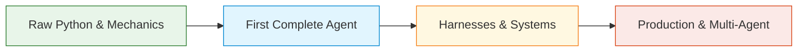

# Module 00: Introduction & Course Overview

**Difficulty Level:** Level 1 — Beginner 
**Prerequisites:** Basic Python (functions, dictionaries, classes), familiarity with LLM chat interfaces.

---

## What This Course Will Teach

Most AI courses teach you how to write prompts or how to use a specific framework (like LangChain, CrewAI, or LlamaIndex). 

This course is different. We teach **how AI agents actually work under the hood**, from the ground up:

1. How the execution control loop works.
2. How tool calling actually occurs (and why LLMs never execute code directly).
3. How state, memory, and context differ and how they are managed.
4. How the agent runtime harness protects against infinite loops, budget overruns, and crashes.
5. How production systems evaluate, secure, and debug real agentic workloads.

---

## The Teaching Philosophy

- **Understand the underlying mechanics first. Use frameworks later.**
- **Zero mandatory dependencies**: Every foundational lesson is built in standard Python 3.11+.
- **Zero API keys required**: Deterministic mock models and simulators let you learn and test completely offline.

---

## How the Modules Build on Each Other

- **[01 — What Is an Agent?](../01-what-is-an-agent/README.md)**: Establishes the agent equation ($\text{Agent} = \text{Model} + \text{Loop} + \text{Environment}$) and contrasts chatbots vs workflows vs autonomous agents.
- **[02 — The Agent Loop](../02-agent-loop/README.md)**: Builds the fundamental Observe-Decide-Act loop in pure Python without models or external libraries.
- **[03 — Tools and Function Calling](../03-tools-and-function-calling/README.md)**: Explores tool registration, schema definitions, model tool selection, and execution by the runtime.
- **[04 — Build Your First Agent](../04-build-your-first-agent/README.md)**: Assembles the model, loop, state, and tools into a working agent in ~100 lines of code.
- **[08 — Agent Runtime and Harness](../08-agent-runtime-and-harness/README.md)**: Introduces the runtime harness—the operating system that manages step limits, error recovery, middleware, and budgets.

---

## Getting Started

1. Read [concepts.md](concepts.md) for the foundational mental models.
2. Complete the setup check in [exercise.md](exercise.md).
3. Proceed to [01-what-is-an-agent](../01-what-is-an-agent/README.md).
