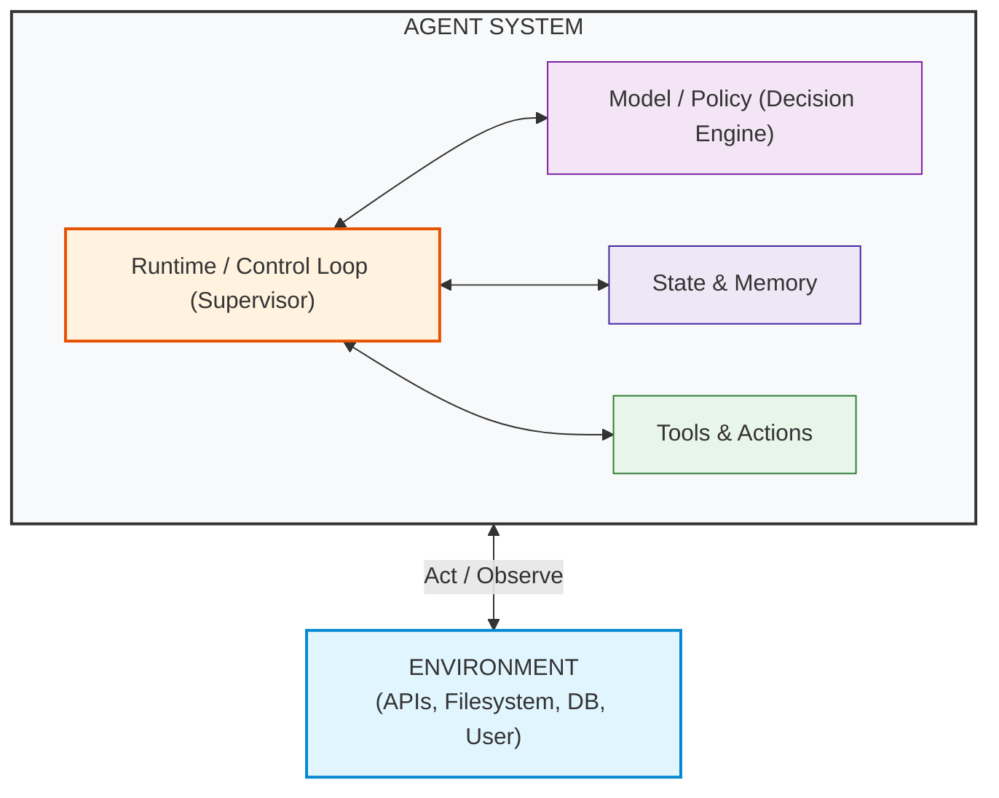
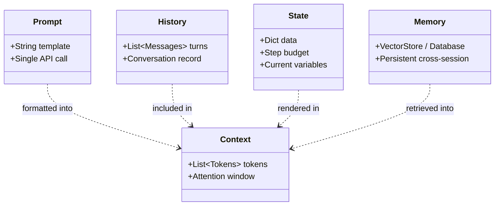

# Foundational Concepts & Mental Models

Before diving into code, let's establish the mental models that will guide your journey through this course.

---

## 1. The Core Agent System Architecture

$$\mathbf{Agent\ System = Model/Policy + Runtime/Control\ Loop + State + Tools}$$

An **Agent System** observes and acts upon an external **Environment**.

Most software engineers starting with LLMs think:
> *"I will give the LLM a prompt like 'You are an agent that solves math problems', and it will magically do it."*

In reality:
- The **Model / Policy** is a probabilistic reasoning engine. It requests actions but does not directly execute Python code or access OS sockets.
- The **Runtime / Control Loop** is the deterministic supervisor code (a state machine or loop) that passes observations to the model, dispatches tool execution, and checks budgets.
- The **State** stores intermediate variables, message logs, and operational flags.
- The **Tools** provide executable capabilities that interface with the external **Environment**.

---

## 2. The Five Key Terms (Never Conflate These)

1. **Prompt**: The static template or instructional string passed into an LLM call (e.g. `f"Answer the user query: {query}"`).
2. **Context**: The actual tokens currently residing inside the model's active attention window during inference.
3. **History**: The chronological list of user, assistant, and tool messages within the ongoing interaction.
4. **State**: The runtime's mutable data structure storing variables, step counters, scratchpads, and execution flags.
5. **Memory**: Long-term storage (such as vector embeddings or relational databases) that persists across multiple tasks or sessions.

---

## 3. Why We Build Without Frameworks First

Agent frameworks (LangGraph, AutoGen, OpenAI Agents SDK, CrewAI) are high-level abstractions. 

When you start by learning a framework:
- You confuse the framework's classes with the underlying mechanics of agents.
- When an agent gets stuck in an infinite loop or drops a tool parameter, you don't know where to look.
- You become locked into specific abstractions that may change or become obsolete.

When you start with **pure Python**:
- You understand exact JSON schemas and protocol contracts.
- You can build your own custom agent harnesses in under 200 lines of code.
- You can evaluate any third-party framework with clarity.
