# Module 01: What Is an AI Agent?

**Difficulty Level:** Level 1 — Beginner 
**Focus:** Dispelling misconceptions, defining agency, and mapping the spectrum from raw LLM to autonomous multi-agent systems.

---

## What You Will Learn

1. Why "agent" is an overloaded term and how to define it with technical precision.
2. **What People Call an Agent — But Isn't Necessarily an Agent**:
   - The 7-Stage Spectrum: `LLM → Chatbot → RAG → Workflow → Tool-Using LLM → AI Agent → Multi-Agent System`.
3. The core differences across four major paradigms:
   - **LLM**: A stateless next-token predictor.
   - **Chatbot**: A turn-based conversational interface.
   - **Workflow**: A hardcoded deterministic sequence of steps.
   - **AI Agent**: An autonomous control loop that observes an environment, decides actions dynamically, and executes them to achieve a goal.
4. The fundamental equation:

$$\mathbf{Agent = Model + Control\ Loop + Environment}$$

---

## The Spectrum of Agency

```mermaid
flowchart LR
    LLM["1. Raw LLM"] --> Chat["2. Chatbot"]
    Chat --> RAG["3. RAG Pipeline"]
    RAG --> Work["4. Workflow"]
    Work --> ToolLLM["5. Tool-Using LLM"]
    ToolLLM --> Agent["6. AI Agent"]
    Agent --> Multi["7. Multi-Agent"]

    style LLM fill:#f5f5f5,stroke:#9e9e9e
    style Chat fill:#e1f5fe,stroke:#0288d1
    style RAG fill:#e0f7fa,stroke:#0097a7
    style Work fill:#fff8e1,stroke:#f57f17
    style ToolLLM fill:#f3e5f5,stroke:#7b1fa2
    style Agent fill:#e8f5e9,stroke:#2e7d32,stroke-width:2px
    style Multi fill:#ede7f6,stroke:#4527a0
```



---

## Module Contents

- **[concepts.md](concepts.md)**: Deep technical exploration of the 7-stage spectrum, autonomy dimensions, and common misconceptions.
- **[example.py](example.py)**: Runnable pure Python demonstration contrasting a Chatbot, a Workflow, and an Agent solving the same user request.
- **[exercise.md](exercise.md)**: Hands-on exercise to identify and classify agentic architectures.

---

## Quick Run

Run the module example directly:

```bash
python 01-what-is-an-agent/example.py
```
