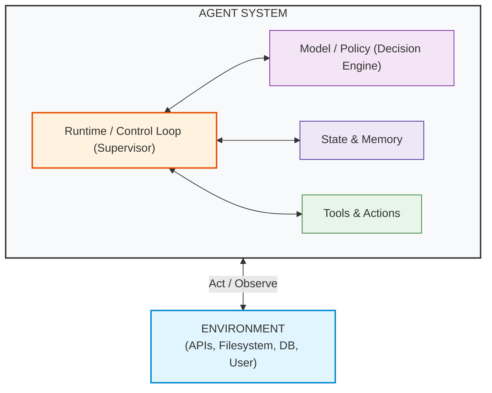
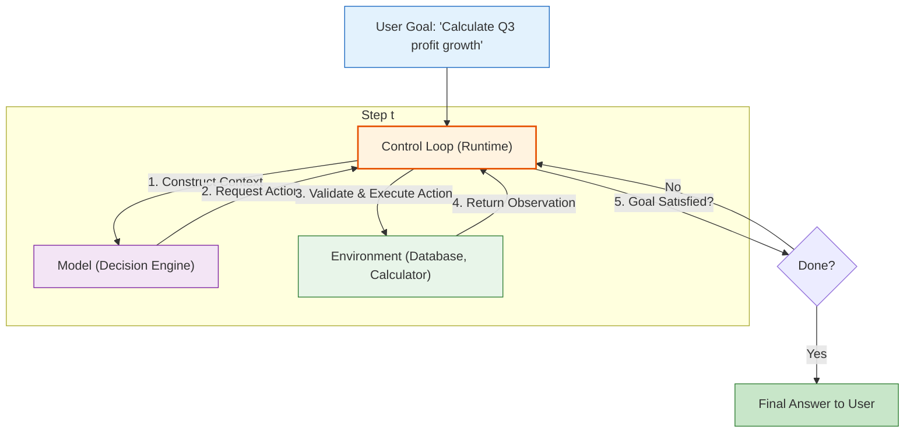

# Concepts: Defining Agency

To build production-grade agentic systems, we must strip away marketing terminology and understand the underlying mechanics of agency.

---

## 1. What Is an AI Agent System?

An **AI Agent System** is a computational architecture comprising a reasoning model/policy, an execution runtime, state representation, and tools that interact with an external **environment** across iterative steps to accomplish a user's goal.

$$\mathbf{Agent\ System = Model/Policy + Runtime/Control\ Loop + State + Tools}$$



---

## 2. What People Call an "Agent" — Operational Spectrum

There is no universally agreed boundary across industry and research for what counts as an "agent." In this course, we use the following operational spectrum to make the architectural differences explicit:

```mermaid
flowchart LR
    LLM["1. Raw LLM"] --> Chat["2. Chatbot"]
    Chat --> RAG["3. RAG Pipeline"]
    RAG --> Work["4. Workflow"]
    Work --> ToolLLM["5. Tool-Using LLM"]
    ToolLLM --> Agent["6. Iterative Autonomous Agent"]
    Agent --> Multi["7. Multi-Agent System"]

    style LLM fill:#f5f5f5,stroke:#9e9e9e
    style Chat fill:#e1f5fe,stroke:#0288d1
    style RAG fill:#e0f7fa,stroke:#0097a7
    style Work fill:#fff8e1,stroke:#f57f17
    style ToolLLM fill:#f3e5f5,stroke:#7b1fa2
    style Agent fill:#e8f5e9,stroke:#2e7d32,stroke-width:2px
    style Multi fill:#ede7f6,stroke:#4527a0
```



### The 7-Stage Operational Spectrum

| Stage | Paradigm | How Decisions Are Made | Can it take actions? | Closed Feedback Loop? | Agentic characteristics |
| :--- | :--- | :--- | :--- | :--- | :--- |
| **1** | **Raw LLM** | Predicts next tokens based on prompt | No | No | **None** |
| **2** | **Chatbot** | Appends user/assistant turns to history | No | Only via user | **Low** |
| **3** | **RAG Pipeline** | Hardcoded retrieval $\to$ LLM synthesis | No | No | **Low** |
| **4** | **Workflow / Chain** | Fixed code sequence ($A \to B \to C$) | Fixed actions | Fixed error handling | **Predetermined control** |
| **5** | **Tool-Using LLM** | Model selects 1 tool $\to$ returns answer | Yes 1-shot action | No iterative retry | **Some** |
| **6** | **Iterative Autonomous Agent** | Dynamic Observe $\to$ Decide $\to$ Act loop | Yes Dynamic actions | Yes Closed runtime feedback | **High** |
| **7** | **Multi-Agent System** | Multiple agents with handoffs & roles | Yes Distributed actions| Yes Inter-agent feedback | **Multiple interacting agents** |

---

## 3. Why Does Agency Exist?

Traditional software requires developers to anticipate every branch of execution beforehand:
```python
if condition_A:
    do_action_1()
elif condition_B:
    do_action_2()
```

When dealing with complex, ambiguous, or multi-step tasks (e.g. *"Find the bug in this repository, write a reproduction script, fix the code, and ensure all tests pass"*), writing a static deterministic workflow is impossible because the exact steps depend on the dynamic output of compiler errors, file structures, and runtime tests.

AI Agents exist to bridge this gap: they provide **dynamic decision-making in open-ended environments**.

---

## 4. How Does It Work?



---

## 5. Minimal Comparison Example

Let's look at how the same goal—*"What is the total revenue of customer 42 from orders and invoices?"*—is handled across paradigms:

### Paradigm A: Chatbot (No Environment Access)
```python
def chatbot(user_prompt: str) -> str:
    # The model has no access to live data; it can only ask the user.
    return "I don't have access to your database. Please provide order records."
```

### Paradigm B: Deterministic Workflow (Rigid)
```python
def deterministic_workflow(customer_id: int) -> dict:
    # Rigid: always executes step 1 then step 2. Cannot adapt if orders are missing.
    orders = db.query_orders(customer_id)
    invoices = db.query_invoices(customer_id)
    return {"total": sum(orders) + sum(invoices)}
```

### Paradigm C: Agent (Dynamic Feedback Loop)
```python
def agent_loop(goal: str, env: Environment) -> str:
    state = {"goal": goal, "history": []}
    while not state.get("is_complete"):
        # 1. Model observes current state and requests next action
        action = model_decide(state)
        if action.type == "finish":
            return action.final_answer
        
        # 2. Runtime executes action in environment
        observation = env.execute(action.tool_name, action.tool_args)
        
        # 3. State updated with observation for next loop iteration
        state["history"].append({"action": action, "observation": observation})
```

---

## 6. Common Misconceptions

> No **Misconception**: *"An LLM with a system prompt telling it to 'be an autonomous researcher' is an agent."* 
> **Reality**: A prompt is just text. Without a control loop to catch outputs, call tools, and feed observations back into the context window, the model cannot perform any actions.

> No **Misconception**: *"Chaining 3 LLM prompts in a Python script makes it an agent."* 
> **Reality**: A static sequence of prompt $A \to$ prompt $B \to$ prompt $C$ is a **workflow** (or chain), not an agent. It becomes an agent when the model dynamically determines the next step based on runtime environment feedback.

---

## 7. Failure Modes

1. **Illusion of Agency**: Building a system that claims to be an agent but is actually an unbounded prompt that hallucinates tool outputs because no runtime executes them.
2. **Infinite Loops**: An agent without a termination condition or maximum step budget can loop indefinitely if the environment returns ambiguous observations.
3. **Misaligned Autonomy**: Giving high agency to a model when a simple, predictable 3-line deterministic script would be 100% reliable, faster, and cheaper.

---

## 8. Where It Appears in Real Systems

| Concept | Pure Mechanics | In Real Production |
| :--- | :--- | :--- |
| **Control Loop** | `while not done:` in Python | LangGraph state machines, Temporal workflows, AWS Step Functions |
| **Environment** | Mock Python functions | Database connectors, REST APIs, Docker containers, Browser drivers |
| **Model Decision** | JSON parsing of model output | OpenAI Structured Outputs, Anthropic Tool Use API |
