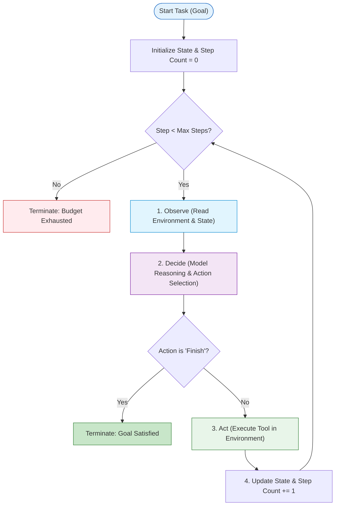

# Module 02: The Agent Loop

**Difficulty Level:** Level 1 — Beginner 
**Focus:** The fundamental execution cycle: Observe $\to$ Decide $\to$ Act $\to$ Observe.

---

## What You Will Learn

1. The mechanics of the central execution control loop in an AI agent.
2. Why a loop is required for iterative problem solving.
3. How state transitions occur from step $t$ to step $t+1$.
4. The 4 critical termination conditions that prevent runaway executions:
   - **Goal Satisfaction**: Agent declares success.
   - **Step Budget Exhaustion**: Maximum iterations reached.
   - **Environment Abortion**: Unrecoverable error or safety tripwire.
   - **Timeout**: Wall-clock execution limit.
5. How to build and trace an execution loop in standard Python.

---

## The Cycle of Execution



---

## Module Contents

- **[concepts.md](concepts.md)**: Deep dive into loop mechanics, state evolution, and termination strategies.
- **[example.py](example.py)**: Runnable pure Python simulation of an agent navigating an interactive grid environment.
- **[exercise.md](exercise.md)**: Add a step budget and cycle-detection mechanism to an unconstrained loop.

---

## Quick Run

```bash
python 02-agent-loop/example.py
```
