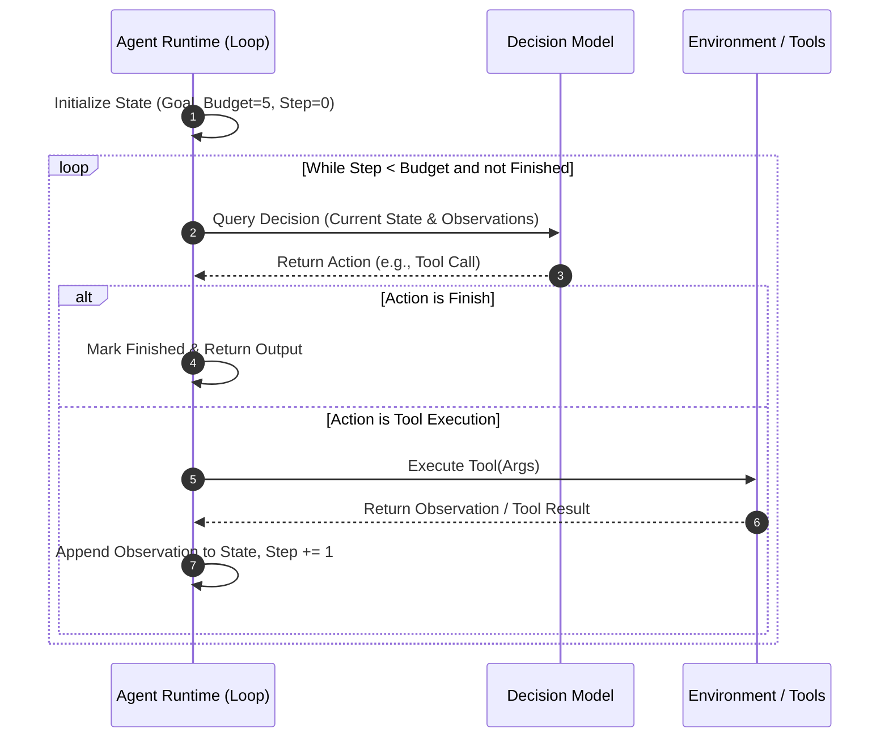

# Concepts: The Agent Control Loop

The control loop is the engine that drives an agent. It transforms a static language model into an active system capable of exploration, error correction, and goal achievement.

---

## 1. What Is It?

The **Agent Loop** is the deterministic supervisor code that repeatedly orchestrates four operations:
1. **Observe**: Gathers information from the environment (e.g. tool output, error logs, sensor data) and merges it into the operational state.
2. **Decide**: Supplies the state to the model and requests the next action.
3. **Act**: Dispatches the action to the external environment.
4. **Evaluate Termination**: Checks if the goal has been achieved, if a limit was reached, or if execution must halt.

---

## 2. Why Does It Exist?

LLMs are stateless: they do not remember what they did three seconds ago, and they cannot run continuously on their own.

Without a control loop:
- A model can only guess an answer in one shot.
- If a tool returns a `404 Not Found` or syntax error, the model cannot see the error, retry, or adjust its hypothesis.

The loop provides the **temporal dimension** and **closed feedback loop** that allows an agent to self-correct over time.

---

## 3. How Does It Work?



### The State Transition Function
Mathematically, the agent loop computes a series of state transitions:

$$S_{t+1} = \text{Update}(S_t, A_t, O_{t+1})$$

Where:
- $S_t$ is the system state at step $t$.
- $A_t = \text{Model}(S_t)$ is the action selected by the model.
- $O_{t+1} = \text{Environment}(A_t)$ is the observation returned by executing $A_t$.
- $S_{t+1}$ is the newly formed state passed to the model on the next iteration.

---

## 4. Minimal Code Example

```python
def run_loop(goal: str, env: Environment, max_steps: int = 10) -> str:
    state = {"goal": goal, "history": []}
    
    for step in range(1, max_steps + 1):
        # 1. Observe & Decide
        action = decide_next_action(state)
        
        # 2. Check Termination
        if action["type"] == "finish":
            return action["content"]
        
        # 3. Act in Environment
        observation = env.run_action(action["name"], action["params"])
        
        # 4. Update State for Next Iteration
        state["history"].append({
            "step": step,
            "action": action,
            "observation": observation
        })
        
    return "Failed: Reached maximum step limit."
```

---

## 5. Common Misconceptions

> No **Misconception**: *"The LLM decides when the while loop breaks."* 
> **Reality**: The LLM emits a token sequence (such as `"action": "finish"`). The **runtime control loop** checks this string, validates that the agent actually signaled completion, and chooses whether to break the loop. The runtime can also forcefully break the loop if a budget or timeout is hit.

> No **Misconception**: *"An agent loop is just an infinite while loop (`while True:`)."* 
> **Reality**: An infinite loop in production is a critical liability that leads to API bill shock and resource starvation. Every professional agent loop is strictly bounded by deterministic stop conditions (max steps, wall-clock timeout, cost limits).

---

## 6. Failure Modes

1. **Repetitive Action Loop (Loop Lock)**: The agent tries action $A$, gets observation $O$ (e.g. permission error), and repeatedly chooses action $A$ again because its reasoning engine fails to register that the action is invalid.
2. **Premature Termination**: The model emits a "finish" action before verifying that its intermediate actions actually succeeded.
3. **Runaway Cost / Budget Blowout**: In the absence of step or token budget limits, a bug in the model prompt causes it to execute hundreds of unnecessary tool calls.

---

## 7. Where It Appears in Real Systems

| Component | Raw Mechanics | In Industry Frameworks |
| :--- | :--- | :--- |
| **Execution Loop** | Python `while` / `for` loop | `AgentExecutor` (LangChain), `CompiledGraph` (LangGraph) |
| **State Evolution** | Python dictionary / Dataclass | StateGraph Reducer (LangGraph), Run Context |
| **Budget Enforcement** | `if step > max_steps: break` | `max_iterations`, `recursion_limit` parameter |
