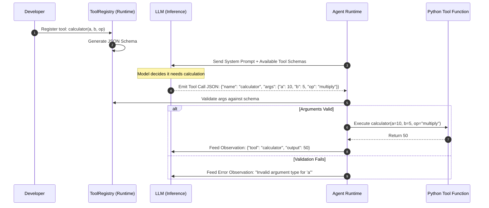

# Module 03: Tools and Function Calling

**Difficulty Level:** Level 2 — Builder 
**Focus:** The complete tool lifecycle, schema generation, argument validation, and execution boundaries.

---

## What You Will Learn

1. Why tools exist and how they extend a model's capabilities beyond static weights.
2. The **Complete 8-Stage Tool Lifecycle**:
   - Tool Definition $\to$ Schema Presentation $\to$ Model Selection $\to$ Argument Generation $\to$ Runtime Validation $\to$ Runtime Execution $\to$ Observation Formatting $\to$ Context Feedback.
3. The fundamental architectural truth: **The LLM never runs your code. The runtime does.**
4. How to generate JSON schemas automatically from Python type hints and docstrings using only the standard library.
5. How to build a clean `ToolRegistry` with validation and error-handling guardrails.

---

## The Complete Tool Lifecycle



---

## Module Contents

- **[concepts.md](concepts.md)**: In-depth technical breakdown of schemas, function calling mechanics, and security boundaries.
- **[example.py](example.py)**: Pure Python `ToolRegistry` with automatic JSON schema generation, argument validation, and mock tool executions.
- **[exercise.md](exercise.md)**: Implement a sandboxed string-manipulation tool with schema validation.

---

## Quick Run

```bash
python 03-tools-and-function-calling/example.py
```
