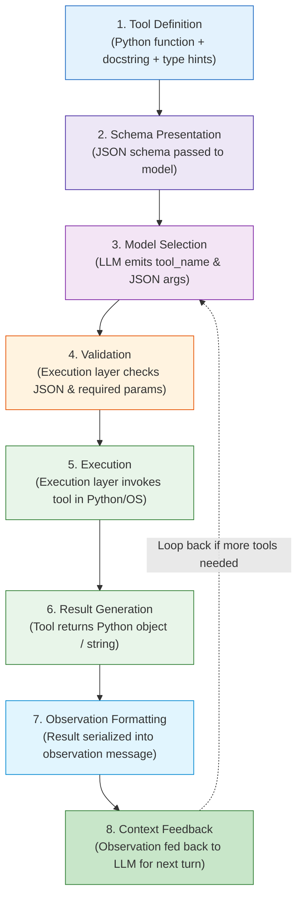
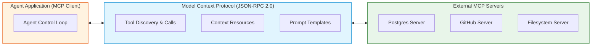

# Concepts: Tools and Function Calling

Tools give language models the ability to interact with the physical and digital world: querying databases, calling APIs, executing mathematical computations, and reading files.

---

## 1. What Is It?

A **Tool** (in the context of AI agents) is an executable capability exposed to a model through a formal declarative contract (typically a **JSON Schema**).

**Function Calling** is the mechanism by which a model detects that it cannot answer a prompt using its internal weights alone, chooses a registered tool, and emits structured JSON containing the arguments required to run that function.

---

## 2. Why Does It Exist?

Language models suffer from three fundamental limitations:
1. **Knowledge Cutoffs**: Weights represent knowledge frozen at training time.
2. **Hallucination in Exact Computation**: LLMs are statistical token estimators, not arithmetic ALUs.
3. **No Direct Environment Access**: A neural network cannot natively query an internal Postgres DB or trigger a Slack webhook.

Tools solve all three:
- An LLM requests `get_stock_price("AAPL")` $\to$ gets real-time data.
- An LLM requests `calculate(14958.29, 39.4, "divide")` $\to$ gets exact arithmetic.
- An LLM requests `send_email(to, subject, body)` $\to$ mutates the outside world.

---

## 3. How Does It Work? (The 8 Stages)



> **Key Rule**: The model chooses or requests an action; an **execution layer** performs it. In a from-scratch agent like the one in this course, that execution layer is our Python runtime. In hosted platforms, the provider may execute certain hosted tools on the application’s behalf.

---

## 4. Understanding MCP (Model Context Protocol)

**MCP (Model Context Protocol)** is an open protocol for connecting AI applications to external capabilities and context providers. MCP servers can expose **tools**, **resources**, and **prompts** through a standardized protocol.



### MCP vs. Function Calling: How They Differ

| Dimension | Function Calling | Model Context Protocol (MCP) |
| :--- | :--- | :--- |
| **Boundary** | **Model $\leftrightarrow$ Application** | **Application $\leftrightarrow$ External Capability / Context Server** |
| **Core Question** | *"How can the model request a structured action?"* | *"How can applications discover and access tools, resources, and prompts through a standard protocol?"* |
| **Transport / Protocol** | Provider-specific model API contract | MCP messages use JSON-RPC 2.0; commonly carried over stdio for local servers or HTTP for remote servers |
| **Exposes** | Local tool signatures for inference | Remote tools, live resources/data, prompt templates |

> **They are complementary, not competitors.** 
> An application can discover a tool through MCP, expose its schema to the model through function/tool calling, receive the model’s requested call, and execute that call through the MCP connection.

---

## 5. Minimal Example: Pure Python Tool Registry

```python
import inspect
from typing import Callable, Any

class ToolRegistry:
    def __init__(self) -> None:
        self._tools: dict[str, Callable[..., Any]] = {}

    def register(self, func: Callable[..., Any]) -> None:
        """Registers a Python function as an available tool."""
        self._tools[func.__name__] = func

    def execute(self, name: str, args: dict[str, Any]) -> Any:
        """Runtime execution of the tool."""
        if name not in self._tools:
            return {"error": f"Tool '{name}' is not registered."}
        
        func = self._tools[name]
        try:
            return {"success": True, "result": func(**args)}
        except Exception as e:
            return {"error": f"Execution error in {name}: {str(e)}"}
```

---

## 6. Common Misconceptions

> No **Misconception**: *"The LLM runs the Python code inside its weights."* 
> **Reality**: The LLM is generating text tokens requesting an action. An execution layer (such as our Python runtime) validates arguments and executes the code.

> No **Misconception**: *"The LLM knows what tools do by reading their bytecode."* 
> **Reality**: The LLM only knows what tools do based on their **name**, **description**, and **parameter documentation** inside the JSON Schema. If your docstrings are misleading or missing, the model will request tools incorrectly.

---

## 7. Failure Modes

1. **Hallucinated Tool Names**: Model attempts to request `fetch_weather_forecast()` when the registered tool is named `get_weather()`.
2. **Schema / Type Violations**: Model passes `"temperature": "hot"` instead of `"temperature": 85.0`.
3. **Missing Tool Error Trapping**: The tool raises an uncaught Python exception (`ZeroDivisionError`), crashing the entire process instead of returning a clean error observation to the model.

---

## 8. Where It Appears in Real Systems

- **OpenAI Function Calling (`tools=[...]`)**: Model API contract for structured tool calls.
- **Anthropic Tool Use (`tools=[...]`)**: Model API contract for `tool_use` and `tool_result` blocks.
- **MCP (Model Context Protocol)**: Open protocol for connecting applications to external tools, resources, and prompts over JSON-RPC 2.0.
