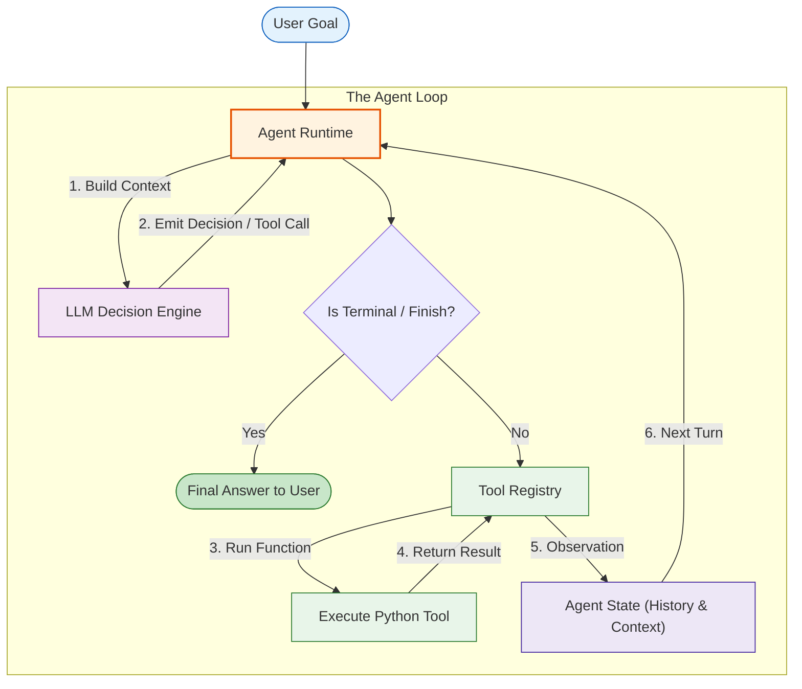
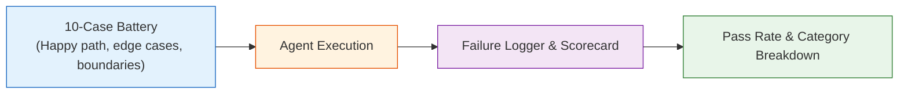

# Module 04: Build Your First Agent

**Difficulty Level:** Level 2 — Builder 
**Focus:** Assembling Model, Tools, Registry, State, Control Loop, and Early Evaluation into your first complete, working AI agent from scratch.

---

## What You Will Learn

1. The "Aha!" moment: Seeing all the independent building blocks connect into a unified, functioning agent.
2. How to build a complete agent in ~140 lines of standard Python with zero dependencies.
3. How `AgentState`, `ToolRegistry`, and `AgentLoop` coordinate to solve multi-step problems.
4. How an agent dynamically decomposes a goal into consecutive tool executions, records observations, and synthesizes a verified final answer.
5. **Early Evaluation**: How to stop "vibes-based debugging" by running a 10-case regression battery, capturing structured failure logs, and proving reliability before moving to state and memory.

---

## The Complete Architecture



---

## Evaluate Your First Agent: 10-Case Regression Scorecard

Most agent tutorials only show the "happy path" (one task where everything works) and then immediately jump into complex abstractions. But when developers start tweaking prompts or tools, they debug based on **"vibes"**—guessing whether changes helped or broke previous tasks.

In this module, we introduce **early evaluation** right after assembling our first agent:



### The 10-Case Battery Breakdown
Our regression battery tests the agent across diverse real-world situations:
1. **Happy Path**: Standard purchase for a verified tier (`cust_42` Gold member).
2. **Tier Variation**: Standard customer (`cust_99` 5% discount).
3. **Unknown Customer**: Missing ID handled gracefully without crashing (`0%` discount applied).
4. **Input Guardrail**: Negative purchase amount rejected early before execution.
5. **Zero Dollar Purchase**: Boundary check on `$0` total.
6. **Budget Tripwire**: Max steps exhausted on tight constraints.
7. **Large Purchase**: Math precision on enterprise transaction (`$10,000`).
8. **Medium Purchase**: Discount subtraction validation (`$500`).
9. **Zero Discount Customer**: Inactive tier handling.
10. **Decimal Purchase**: Floating-point cents precision (`$125.50`).

### Structured Failure Log
When an agent fails a test case, it should never fail silently. The runtime records a structured `FailureRecord`:

```text
STRUCTURED FAILURE LOG:
  [Case #4] Negative purchase rejection
    Type:     INPUT_VALIDATION_FAILURE
    Expected: cannot be negative
    Actual:   Final bill: $-40.00
```

Failure categories tracked:
- `INPUT_VALIDATION_FAILURE`: Failed to reject malformed or invalid inputs before tool execution.
- `TOOL_SELECTION_FAILURE`: Model requested the wrong tool or skipped required tools.
- `TOOL_EXECUTION_FAILURE`: Tool threw an uncaught error or received missing parameters.
- `BUDGET_EXCEEDED`: Agent exceeded step limits before completing the task.
- `UNEXPECTED_ANSWER`: Final output did not match verified ground truth.

### Before vs. After Comparison
By running the scorecard against our initial prototype (`NaiveDecisionEngine` v1) vs our hardened agent (`RobustDecisionEngine` v2), we see concrete proof of improvement:

```text
=================================================================
BEFORE / AFTER REGRESSION COMPARISON
=================================================================
  v1 Naive Model:  5/10 passed (50.0%)
  v2 Robust Model: 10/10 passed (100.0%)
Evaluation proves reliability improvements objectively without guessing on 'vibes'!
=================================================================
```

> **Note on Course Progression**: Basic regression testing begins here in **Module 04** to establish rigorous measurement habits before touching memory. **Module 11 (Agent Evaluation)** deepens this discipline into production-grade infrastructure: multi-turn LLM-as-a-judge, trajectory benchmarks, latency/token efficiency, and continuous regression suites.

---

## Module Contents

- **[concepts.md](concepts.md)**: Architectural breakdown of components and early evaluation theory.
- **[example.py](example.py)**: Complete, standalone runnable agent with 10-case regression scorecard and before/after comparison.
- **[exercise.md](exercise.md)**: Extend the agent with shipping fees and add a new regression test case.

---

## Quick Run

```bash
python3 04-build-your-first-agent/example.py
```
