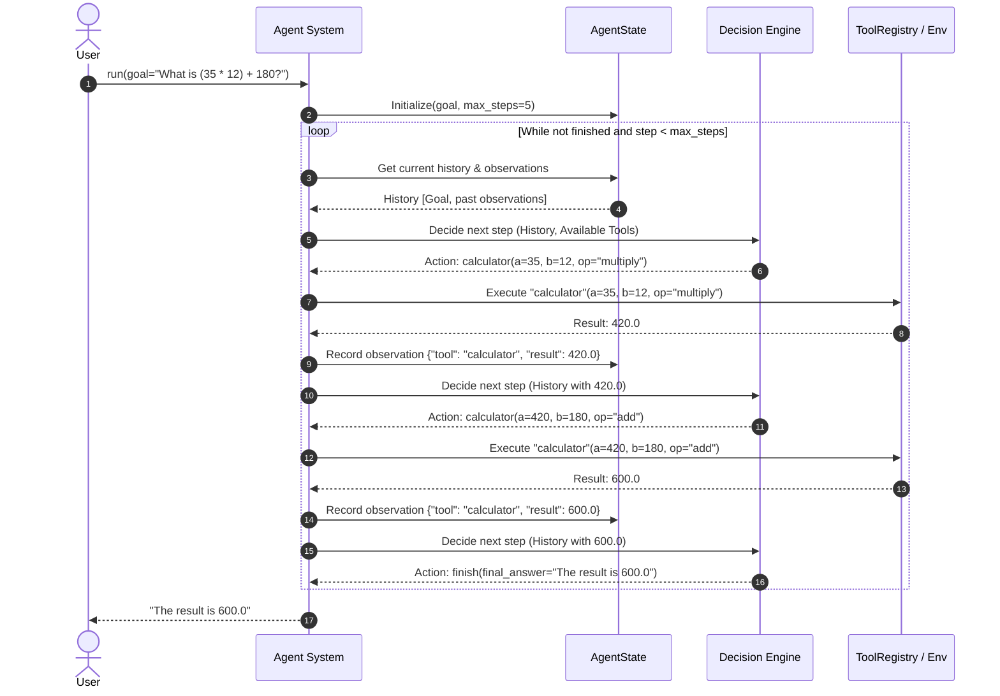

# Concepts: Assembling the Complete Agent

In this module, we assemble the foundational blocks we've built so far—**State**, **Tool Registry**, **Decision Engine**, and **Control Loop**—into a cohesive, functional agent system that interacts with its environment.

---

## 1. What Is It?

A complete **AI Agent System** is the combination of:
1. **AgentState**: A data structure holding the active goal, message history, tool observations, and step counters.
2. **ToolRegistry / Actions**: The catalog of available environment actions and their execution handlers.
3. **Decision Engine (Model / Policy)**: The intelligence layer that reads the state, reasons about the goal, and selects actions.
4. **Agent Runtime / Control Loop**: The supervisor that drives the loop, enforces budgets, invokes tools, updates state, and returns the final answer.

The Agent System observes and acts upon an external **Environment**.

$$\mathbf{Agent\ System = Model/Policy + Runtime/Control\ Loop + State + Tools}$$

---

## 2. Why Does It Exist?

Until now, we've looked at components in isolation:
- In Module 01, we explored the operational spectrum.
- In Module 02, we built the control loop.
- In Module 03, we built the tool registry.

Without assembling them cleanly:
- Code becomes a tangled spaghetti script of prompts, if-statements, and API calls.
- Swapping models, adding tools, or inspecting logs becomes painful.
- Errors cannot be isolated.

A clean, modular architecture separates **reasoning** (the model) from **execution** (the runtime and tools).

---

## 3. How Does It Work?



---

## 4. Minimal Architectural Blueprint

```python
@dataclass
class AgentState:
    goal: str
    messages: list[dict[str, Any]] = field(default_factory=list)
    step: int = 0
    is_finished: bool = False
    final_response: str | None = None

class Agent:
    def __init__(self, model: DecisionEngine, registry: ToolRegistry, max_steps: int = 10):
        self.model = model
        self.registry = registry
        self.max_steps = max_steps

    def run(self, goal: str) -> str:
        state = AgentState(goal=goal)
        state.messages.append({"role": "user", "content": goal})

        while not state.is_finished and state.step < self.max_steps:
            state.step += 1
            decision = self.model.decide(state.messages, self.registry.get_schemas())
            
            if decision.is_terminal:
                state.is_finished = True
                state.final_response = decision.content
                break

            tool_result = self.registry.execute(decision.tool_name, decision.tool_args)
            state.messages.append({"role": "tool", "name": decision.tool_name, "content": tool_result})

        return state.final_response or "Task incomplete: step limit reached."
```

---

## 5. Common Misconceptions

> No **Misconception**: *"An agent needs a 1,000-line framework to coordinate tools and memory."* 
> **Reality**: As shown above, the core mechanics of a production-style agent require approximately 50 to 100 lines of standard Python. Frameworks add convenience abstractions, but the core engine is simple.

> No **Misconception**: *"The agent state is just the chat history."* 
> **Reality**: Chat history is one component of state. State also contains step counts, token usage, tool permissions, scratchpad variables, and runtime flags.

---

## 6. Failure Modes

1. **State Mutation Loss**: Failing to pass previous tool observations into the model context in subsequent iterations, causing the agent to repeat the first step forever.
2. **Untrapped Tool Crashes**: An unhandled exception in a tool terminating the entire process instead of appending an error message to the state for model recovery.
3. **Hallucinated State**: The model claiming it completed an action without actually requesting the required tool call.

---

## 7. Where It Appears in Real Systems

| Component | In Our Scratch Implementation | In Industry |
| :--- | :--- | :--- |
| **Agent Class** | `Agent` | `AgentExecutor` (LangChain), `Workflow` (Temporal) |
| **State** | `AgentState` dataclass | `StateGraph` TypedDict (LangGraph), `SessionState` |
| **Decision Interface** | `LLMInterface.decide()` | `ChatOpenAI.bind_tools()`, `anthropic.messages.create()` |
