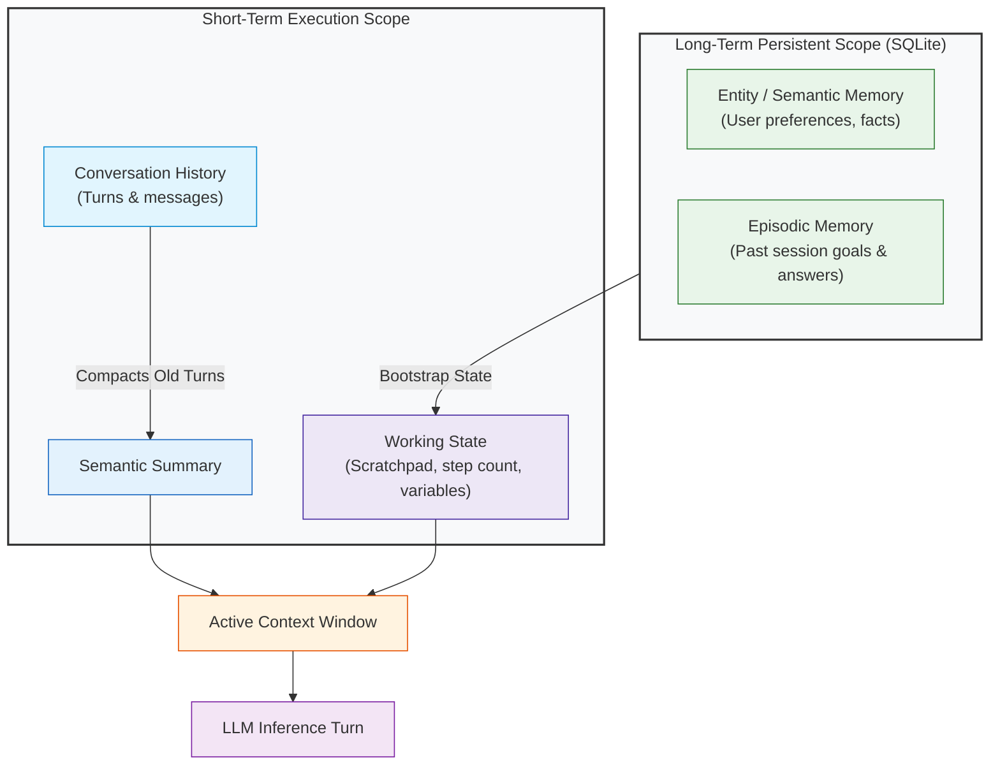

# Module 05: State and Memory

**Difficulty Level:** Level 2 — Builder 
**Status:** Ready

---

## What You Will Learn

1. The critical architectural differences between **Context**, **State**, **History**, and **Memory**.
2. How to manage short-term working state vs. persistent long-term storage across sessions.
3. Common misconceptions: Why calling every vector database "memory" leads to poor agent design.
4. Implementing episodic and semantic memory stores using pure standard Python (`sqlite3`).
5. Preventing context window explosion through sliding-window conversation compaction.

---

## The Multi-Tiered Memory Architecture



---

## Core Questions This Module Answers

- *Where should agent state live when an execution spans multiple asynchronous hours?*
- *How do you prevent memory retrieval from injecting stale or conflicting facts into the active context?*
- *When is a simple relational key-value store superior to an expensive vector database for agent state?*
- *How do agents compact 30-turn histories into small summaries without losing key variables?*

---

## Module Contents

- **[concepts.md](concepts.md)**: Theoretical breakdown of the 4 data layers, episodic/semantic/procedural memory, compaction, and failure modes.
- **[example.py](example.py)**: Runnable pure Python demonstration of working state, SQLite persistent memory, and sliding-window compaction.
- **[exercise.md](exercise.md)**: Extend the persistent store with Time-To-Live (TTL) expiration and GDPR user data deletion (`forget_user`).

---

## Quick Run

```bash
python3 05-state-and-memory/example.py
```
