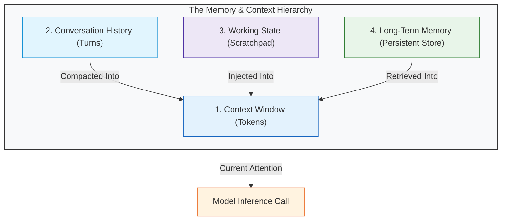
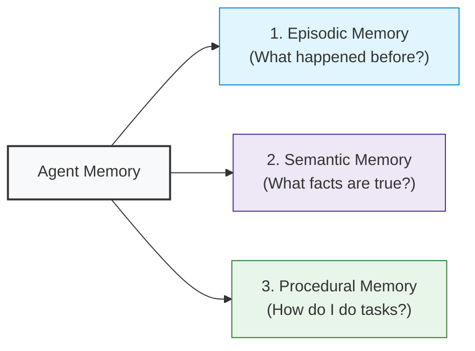
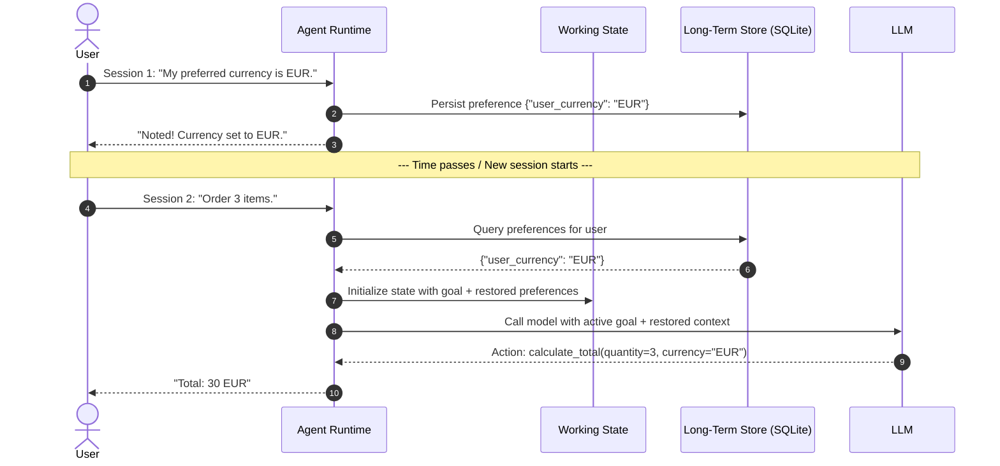

# Concepts: State and Memory

A core difference between a stateless LLM completion call and an operational AI agent is the ability to maintain, update, and recall information across time.

However, "memory" is one of the most frequently misunderstood terms in AI engineering. Developers often treat memory as synonymous with "dumping text into a vector database." In production, memory is a multi-tiered hierarchy with distinct lifespans and responsibilities.

---

## 1. Disambiguation: The 4 Core Data Layers

Never conflate these four concepts:



| Concept | What It Actually Is | Lifespan | Storage Mechanism |
| :--- | :--- | :--- | :--- |
| **Context Window** | The exact sequence of tokens passed to the model's attention mechanism at step $t$. | Single API Call | Transient memory (RAM) |
| **Conversation History** | The chronological log of raw user, assistant, and tool messages in a conversation. | Single Session | List of message dictionaries |
| **Working State** | The runtime's operational scratchpad (step budget, active variables, partial results). | Single Task Execution | In-memory Dataclass |
| **Long-Term Memory** | Knowledge, user preferences, and past trajectory outcomes persisted across tasks. | Multi-Session / Permanent | Relational DB (SQLite/Postgres), Vector DB, Key-Value |

---

## 2. The Three Types of Agent Memory

Borrowing from cognitive science, agent systems divide long-term storage into three distinct categories:



### 1. Episodic Memory (Experience)
- **Question Answered**: *"What did we do last time, and what was the outcome?"*
- **Example**: Log of past user requests, previously resolved bugs, or past execution errors.
- **Implementation**: Chronological audit logs, session summaries, or trajectory archives.

### 2. Semantic Memory (Facts & Knowledge)
- **Question Answered**: *"What are the relevant facts and entities?"*
- **Example**: "Customer Alice prefers metric units and is a Gold tier member."
- **Implementation**: Key-value metadata stores, relational databases (SQLite/Postgres), or vector knowledge bases.

### 3. Procedural Memory (Rules & Recipes)
- **Question Answered**: *"What is the standard procedure to execute this capability?"*
- **Example**: Tool schemas, system prompts, few-shot trajectory templates, and workflow graphs.
- **Implementation**: Code definitions, prompt templates, and execution runbooks.

---

## 3. The Lifecycle of State & Memory



---

## 4. History Compaction: Surviving the Context Limit

As an agent takes 10, 20, or 50 turns, the raw conversation history grows linearly, eventually threatening:
1. **Context Window Exhaustion**: Hitting the model's hard token limit.
2. **Cost & Latency Explosion**: Every subsequent step re-sends the entire history, quadratic in cumulative tokens.
3. **Attention Degradation (Lost in the Middle)**: Models perform worse at reasoning over massive, noisy histories.

### The Compaction Strategy: Sliding Windows + Semantic Summary

```mermaid
flowchart TD
    Raw["Raw History: 30 Turns"]
    
    subgraph Compaction["Compaction Process"]
        Older["Turns 1 to 24 (Historical)"] --> Summarizer["Summarizer Engine"]
        Summarizer --> Summary["Semantic Summary:<br/>'User requested invoice 42; retrieved and validated.'"]
        Recent["Turns 25 to 30 (Active Context)"]
    end

    Summary --> Compacted["Compacted Context Window"]
    Recent --> Compacted
    Compacted --> LLM["Next Model Turn"]

    style Raw fill:#ffebee,stroke:#c62828
    Older fill:#f5f5f5,stroke:#9e9e9e
    Summary fill:#ede7f6,stroke:#4527a0
    Recent fill:#e8f5e9,stroke:#2e7d32
    Compacted fill:#e3f2fd,stroke:#1565c0
    LLM fill:#fff3e0,stroke:#e65100
```

Rather than dropping old messages naively (FIFO truncation), a production agent:
1. Keeps the **most recent $N$ turns** intact (to preserve immediate conversational flow).
2. Compresses **older turns** into an updated structured summary.
3. Preserves **critical entity variables** in working state so calculations never lose ground truth.

---

## 5. Storage Comparison: When to Use What

| Storage Engine | Best Suited For | Limitations | Python Stdlib? |
| :--- | :--- | :--- | :--- |
| **In-Memory Dict / Dataclass** | Short-term task scratchpad, step budgets, active observations | Lost when process exits | Yes (`dataclasses`) |
| **SQLite (Relational)** | Structured facts, customer profiles, audit logs, persistent state | Requires schema design | Yes (`sqlite3`) |
| **Flat File / JSON** | Simple config, local task snapshots | Concurrency issues, slow search | Yes (`json`) |
| **Vector Database** | Unstructured semantic search over thousands of past documents | Non-deterministic retrieval, hallucinated matches | No (requires third-party) |

> **First-Principles Rule**: Start with an in-memory Dataclass for working state and a standard SQLite database for long-term facts. Do not add an external vector database until your retrieval requirements genuinely require fuzzy semantic similarity.

---

## 6. Common Failure Modes in State & Memory

1. **Memory Contamination / Hallucination**:
   - Storing unverified model hallucinations into the permanent store. Future turns retrieve the hallucinated fact as "ground truth."
   - *Mitigation*: Only persist verified user inputs or validated tool outputs to long-term memory.
2. **Stale State Overwrite**:
   - An agent retrieves a cached fact (e.g. `order_status = 'pending'`), but the environment has since changed to `'shipped'`. The agent acts on the stale memory without reconciling.
   - *Mitigation*: Reconciliation checks before executing destructive actions.
3. **Context Window Over-Pollution**:
   - Dumping thousands of raw memory search results into the prompt, pushing out system instructions and recent tool feedback.
   - *Mitigation*: Strict token budgets for retrieved memory (e.g., max 500 tokens).

---

## 7. Where It Appears in Real Systems

| Concept | In Our Scratch Implementation | In Real Production |
| :--- | :--- | :--- |
| **Working State** | `AgentState` dataclass | LangGraph `StateGraph`, Temporal Workflow State |
| **Long-Term Store** | `sqlite3` relational table | Postgres, Redis, DynamoDB |
| **Compaction** | `summarize_history()` | LangChain `ConversationSummaryBufferMemory`, Mem0 |
| **Memory Isolation** | Session / User ID scoping | Multi-tenant row-level security (RLS) |
