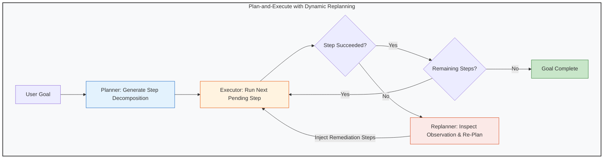

# Module 06: Planning and Reasoning

**Difficulty Level:** Level 3 — Systems 
**Status:** Ready

---

## What You Will Learn

1. The mechanics of structured reasoning paradigms: **ReAct** (Reason + Act), **Plan-and-Execute**, and **Tree-of-Thoughts**.
2. Dynamic task decomposition: Breaking high-level user goals into structured dependency graphs (DAGs).
3. The vital counter-intuitive truth: **More reasoning does not automatically produce a better agent** (and when deep reasoning degrades performance or multiplies costs).
4. Reflection and self-critique loops: Detecting plan deviation and replanning at runtime.
5. Internal reasoning tokens (o1/o3, R1) vs. external orchestrator planning runtimes.

---

## The Planning and Replanning Architecture



---

## Core Questions This Module Answers

- *When should an agent create a full upfront plan vs. acting reactively step-by-step?*
- *How does an agent recover when step 2 of a 4-step plan fails due to an unexpected environment obstacle?*
- *Why does excessive reasoning degrade performance on simple tasks while being mandatory on complex tasks?*
- *How do internal reasoning models (like OpenAI o1/o3 or DeepSeek R1) interface with external planning loops?*

---

## Module Contents

- **[concepts.md](concepts.md)**: Theoretical breakdown of the planning spectrum, ReAct vs. Plan-and-Execute, reasoning trade-offs, and dynamic replanning anatomy.
- **[example.py](example.py)**: Pure Python comparison between a Rigid Plan-and-Execute agent (which crashes on a port conflict) and an Adaptive Planning agent (which diagnoses the error, terminates the zombie process, and succeeds).
- **[exercise.md](exercise.md)**: Extend the planner with dependency-aware DAG step execution and per-step retry limits.

---

## Quick Run

```bash
python3 06-planning-and-reasoning/example.py
```
