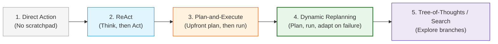
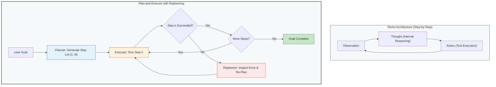
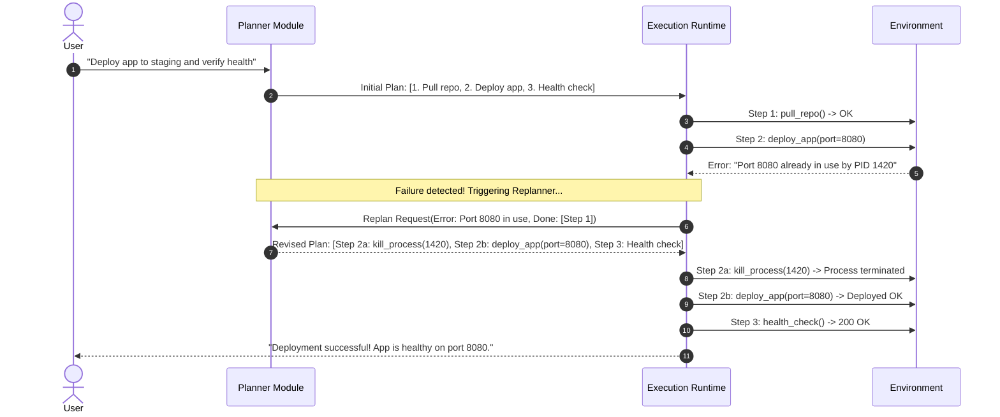

# Concepts: Planning, Reasoning, and Replanning

In simple environments, an agent can act reactively: observe the world, choose a tool, and repeat. But for non-trivial, multi-stage goals—such as diagnosing a distributed database outage or refactoring a code repository—purely reactive agents frequently get lost, repeat redundant steps, or fail to foresee obvious blockers.

To solve complex tasks, agents use **structured reasoning and planning**.

---

## 1. The Planning Spectrum

Agent planning exists on a spectrum from instantaneous reaction to deliberative graph search:

### Paradigm A: Pure Reactive (No Explicit Reasoning)
- **Mechanism**: The model immediately maps state directly to an action without an intermediate scratchpad.
- **Flaw**: Highly prone to short-sighted blunders and greedy choices that lead to dead ends.

### Paradigm B: ReAct (Reason + Act)
- **Mechanism**: At every turn, the agent generates an explicit natural-language **Thought** before generating the **Action** (Tool Call).
- **Formula**: $\text{Observation} \to \text{Thought} \to \text{Action} \to \text{Observation}$.
- **Benefit**: Forces the model to synthesize intermediate observations and articulate a rationale before acting.

### Paradigm C: Plan-and-Execute (Upfront Decomposition)
- **Mechanism**: 
  1. A **Planner** breaks down a high-level goal into an explicit ordered list of subtasks (a DAG: Directed Acyclic Graph).
  2. An **Executor** executes the subtasks sequentially.
- **Benefit**: Long-horizon vision; prevents premature termination or skipping required preparatory steps.

### Paradigm D: Dynamic Replanning (Adaptive Execution)
- **Mechanism**: Plan upfront, but monitor runtime observations. When an execution fails or returns unexpected data, a **Replanner** alters the remaining subtasks dynamically.
- **Benefit**: Combines the strategic horizon of planning with the resilience of reactive systems.

---

## 2. ReAct vs. Plan-and-Execute Architecture

---

## 3. The Counter-Intuitive Truth: When Planning Degrades Performance

A common beginner mistake is assuming:
$$\text{More Planning} = \text{Better Agent}$$

In practice, excessive or rigid planning often makes agent systems **slower, more expensive, and more brittle**:

| Scenario | Pure ReAct | Rigid Plan-and-Execute | Winner | Why |
| :--- | :--- | :--- | :--- | :--- |
| **Simple 1-2 Step Query** | 1 prompt call | 2 prompt calls (Planner + Executor) | **ReAct** | Planning adds 2x latency and cost with zero quality benefit. |
| **High Environment Uncertainty** | Adapts after every tool output | Plan becomes invalid on step 2; gets stuck | **Dynamic Replanning** | Rigid plans assume a static world that rarely exists in real systems. |
| **Complex 8-Step Refactor** | Forgets initial goal around step 5 | Maintains global checklist across turns | **Plan-and-Execute** | Prevents context drift and ensures all requirements are met. |

### The Three Costs of Planning
1. **Latency Overhead**: Generating an upfront plan requires a full model inference pass before any real tool is invoked.
2. **Context Window Inflation**: Long task checklists and step histories consume significant context tokens.
3. **Plan Hallucination**: Models frequently generate plans based on assumptions about files or APIs that do not exist, and then blindly attempt to follow them.

---

## 4. The Anatomy of Dynamic Replanning

When an unexpected event occurs during execution (e.g. an API returns `404 Not Found` or a server port is already bound), a production agent does not crash. It triggers **reconciliation**:

---

## 5. Reasoning Models vs. External Planning Runtimes

With the emergence of models with internal reasoning tokens (e.g. OpenAI o1/o3, DeepSeek R1), where does external planning belong?

- **Internal Model Reasoning (Chain of Thought)**:
  - Best for: Pure mathematical reasoning, algorithmic logic, and code synthesis within a single turn.
  - Limitation: Cannot pause mid-thought to execute a bash tool, check a database, and resume thinking with fresh data.
- **External Agent Planning (Orchestrator)**:
  - Best for: Environment interaction, tool call coordination, error recovery, and tasks that span minutes or hours.
  - Conclusion: **They are complementary.** An external agent loop coordinates the macroscopic plan, while reasoning models handle tough microscopic decisions at each step.

---

## 6. Common Failure Modes in Planning

1. **The Sunk-Cost Loop**:
   - The agent stubbornly retries a failing step using identical arguments because the plan told it to execute that step.
   - *Defense*: Track consecutive tool failures. If a step fails twice, trigger replanning or human escalation.
2. **Premature Completion ("Declaration of Victory")**:
   - The model claims the overall goal is accomplished while only completing step 1 of 4.
   - *Defense*: The runtime verifies that all required subtasks in the plan are marked complete before accepting a termination action.
3. **Plan Bloat**:
   - The planner generates an impractical 25-step plan for a trivial 2-step task.
   - *Defense*: Constrain plan length in the prompt schema (e.g. `max_plan_steps: 6`).

---

## 7. Where It Appears in Real Systems

| Planning Concept | In Our Scratch Implementation | In Industry |
| :--- | :--- | :--- |
| **ReAct Loop** | `Thought:` before `tool_call` | LangChain `create_react_agent` |
| **Plan-and-Execute** | `Planner` + `Executor` classes | Plan-and-Solve Prompting, BabyAGI |
| **Replanning** | `replan()` on error observation | Devin / Claude Code repair loops |
| **Task Graph** | List of `TaskStep` dataclasses | LangGraph StateGraph, CrewAI Flows |
