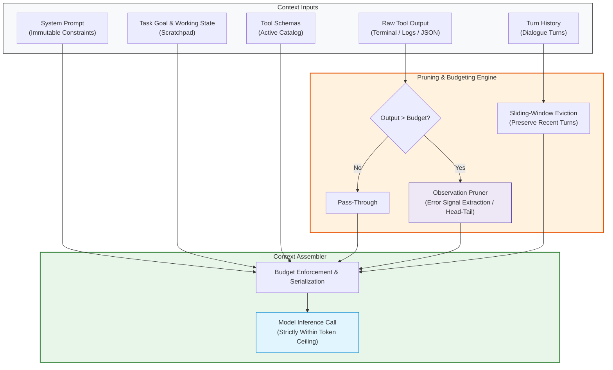

# Module 07: Context Engineering

**Difficulty Level:** Level 3 — Systems 
**Status:** Ready

---

## What You Will Learn

1. What actually enters the model context on every turn (System prompt, dynamic state, tool catalogs, tool observations, turn history).
2. The physics of the context window: Attention degradation, the "Lost in the Middle" phenomenon, and token economics.
3. **Context Pollution**: How stale tool observations, verbose JSON dumps, and noisy terminal outputs degrade model reasoning over extended runs.
4. Observation pruning strategies: Head/tail truncation, error signal grep extraction, and JSON projection.
5. Context budgeting: Enforcing strict partition ceilings to prevent window overflow and control cumulative inference costs.

---

## The Context Assembly and Pruning Architecture



---

## Core Questions This Module Answers

- *How do you keep an agent running for 50+ turns without blowing past context limits or multiplying API costs?*
- *Why does dumping raw 5,000-line terminal logs cause agents to overlook the actual error?*
- *What parts of state should be preserved as immutable anchors vs. compacted or evicted?*
- *How do you mathematically budget tokens across system rules, tools, history, and observations?*

---

## Module Contents

- **[concepts.md](concepts.md)**: Deep dive into the physics of the context window, "Lost in the Middle", token economics, forms of context pollution, and the 4 pruning patterns.
- **[example.py](example.py)**: Runnable pure Python demonstration of token budget allocation, automated error signal extraction from a 250-line server log, and a 92%+ token reduction.
- **[exercise.md](exercise.md)**: Extend the assembler with dynamic task-phase tool filtering and stale observation deduplication.

---

## Quick Run

```bash
python3 07-context-engineering/example.py
```
