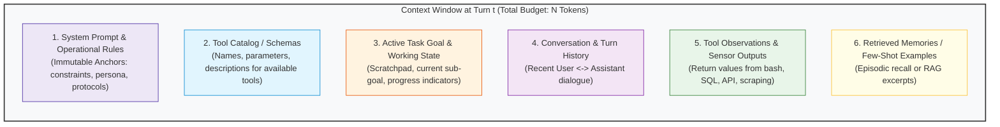
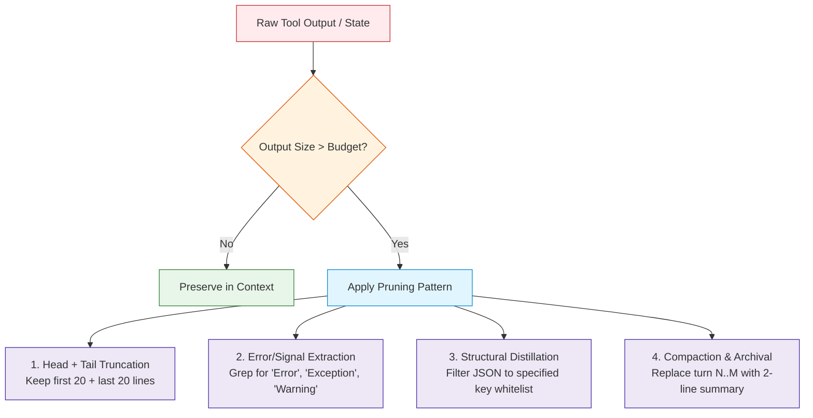

# Concepts: Context Engineering and Token Economics

In modern LLM applications, the **Context Window** is your application's physical RAM. Everything the model considers when generating a decision—system rules, operational history, tool definitions, scratchpad variables, and environment observations—must fit inside this finite buffer.

However, treating the context window as an unbounded dump leads directly to **Context Pollution**, **Lost-in-the-Middle Degradation**, and **Exponential Cost Inflation**.

**Context Engineering** is the discipline of actively budgeting, structuring, filtering, and compressing information so the model receives maximal signal with minimal noise at every turn.

---

## 1. Anatomy of an Agent Context Window

At turn $t$, what actually gets serialized into the prompt sent to the LLM?



| Component | Mutability | Volatility | Optimal Engineering Strategy |
| :--- | :--- | :--- | :--- |
| **System Prompt** | Static | Low | Fixed anchor; enforce strict brevity and clear delimiters. |
| **Tool Schemas** | Semi-Static | Low/Medium | Dynamic filtering; expose only tools relevant to current subtask. |
| **Active Goal / State** | Dynamic | Medium | Keep in compact key-value or scratchpad format; overwrite stale fields. |
| **Turn History** | Append-only | Medium | Sliding window or semantic compaction; drop older conversational filler. |
| **Tool Observations** | Append-only | Very High | **Primary source of pollution!** Head/tail truncate, grep for errors, distill raw JSON. |
| **Retrieved Memory** | Dynamic | High | Retrieve only top-$k$ relevant chunks; strictly cap token allocation. |

---

## 2. The Physics of Context Windows

### A. The "Lost in the Middle" Phenomenon
Research (Liu et al., Stanford/Berkeley 2023) demonstrated that language models retrieve and reason over information located at the **very beginning (primacy bias)** and the **very end (recency bias)** of the context window with significantly higher fidelity than information buried in the middle:

```
[Beginning of Context]  ========================================  High Attention / High Recall
[Middle of Context]     ----------------------------------------  Degraded Attention / Hallucination Risk
[End of Context]        ========================================  High Attention / High Recall
```

**Rule of Thumb**:
- Put immutable rules and safety constraints at the **top** (System Prompt).
- Put immediate observations, current tool outputs, and the final decision directive at the **bottom** (Final Turn).
- Never hide critical instructions in the middle of a 20,000-token historical tool dump.

### B. Token Economics and Latency
Every token injected into the context window has a compounding financial and performance cost:
- **Inference Latency (Time-to-First-Token / TTFT)** scales linearly or super-linearly with input context length.
- **API Billing**: Input tokens are billed on **every turn**. In a 30-turn agent run where context grows from 2k to 64k tokens, you are not paying for 64k tokens once—you are paying for the cumulative integral of the context size across all 30 turns:

$$\text{Cumulative Input Tokens} = \sum_{t=1}^{T} \text{ContextSize}(t)$$

An agent whose context grows without pruning to 30,000 tokens across 20 turns processes over **300,000 billed input tokens** for a single user task.

---

## 3. Context Pollution: The Silent Agent Killer

Context pollution occurs when useless, noisy, or contradictory tokens occupy the attention window, degrading the model's reasoning capabilities.

### Major Forms of Context Pollution:
1. **Raw Log Dumps**:
   - An agent runs `cat /var/log/nginx/error.log` and gets 4,000 lines of standard notice messages with 1 critical error on line 3,892.
   - *Impact*: Consumes 30,000 tokens, triggers attention dilution, and hides the error in the middle.
2. **Verbose JSON Payloads**:
   - An API call returns a 500-key nested object when the agent only needed `status` and `id`.
   - *Impact*: Wastes context and induces schema hallucination.
3. **Stale Historical Outputs**:
   - Turn 2: Agent checks file `config.py` (syntax error present).
   - Turn 4: Agent edits `config.py` (fixed).
   - Turn 7: Model looks at Turn 2's unpruned observation and hallucinates that the error still exists!
   - *Impact*: Contradictory state causes oscillation loops.

---

## 4. Engineering Solutions: The 4 Pruning Patterns



### Pattern 1: Head and Tail Truncation
When capturing command outputs or logs, the most informative lines are almost always at the **start** (command execution headers) and the **end** (stack traces or exit codes).
```python
def head_tail_truncate(text: str, max_lines: int = 40) -> str:
    lines = text.splitlines()
    if len(lines) <= max_lines:
        return text
    half = max_lines // 2
    omitted = len(lines) - max_lines
    return "\n".join(lines[:half] + [f"[... {omitted} lines omitted ...]"] + lines[-half:])
```

### Pattern 2: Error and Signal Extraction (Grep Distillation)
Instead of returning 10,000 lines of terminal output, search for keywords (`ERROR`, `FAIL`, `Traceback`, `Exception`, `FATAL`) and extract 3 lines of context around each match.

### Pattern 3: Schema/JSON Projection
Filter JSON API responses to only the fields declared in a whitelist before injecting into history:
```python
def project_json(raw: dict, allowed_keys: set[str]) -> dict:
    return {k: v for k, v in raw.items() if k in allowed_keys}
```

### Pattern 4: Anchored Sliding Window
Keep static anchors permanently (System prompt, Task Goal, Current Tool Catalog), while maintaining a strict rolling window of the last $K$ turns. Replace evicted turns with a single concise progress bullet.

---

## 5. Token Budget Allocation

A robust agent harness assigns strict token budgets to each context partition:

```
Total Context Ceiling: 4,000 Tokens (Example)
+-------------------------------------------------------------+
| System Prompt & Core Invariants         : 400 Tokens  (10%) |
| Active Goal & Working Scratchpad        : 300 Tokens  (7.5%)|
| Tool Catalog (Filtered Schemas)         : 500 Tokens  (12.5%)
| Historical Turn Dialogue (Sliding Window): 1,200 Tokens(30%)|
| Latest Tool Observations (Distilled)    : 1,000 Tokens(25%) |
| Reserved Output Buffer (Max Tokens Out) : 600 Tokens  (15%) |
+-------------------------------------------------------------+
```

If any single partition exceeds its allotment, automated pruning triggers **before** the request is dispatched to the model.

---

## 6. Where This Fits in the Hierarchy

- **Module 03 (Tools)** taught you how to generate tool schemas.
- **Module 05 (State & Memory)** taught you how to store state persistently across sessions.
- **Module 07 (Context Engineering)** governs what exact slice of state, tools, and logs is admitted into the model's immediate inference buffer on turn $t$.
- **Module 08 (Harness)** enforces these limits as automated runtime tripwires.
