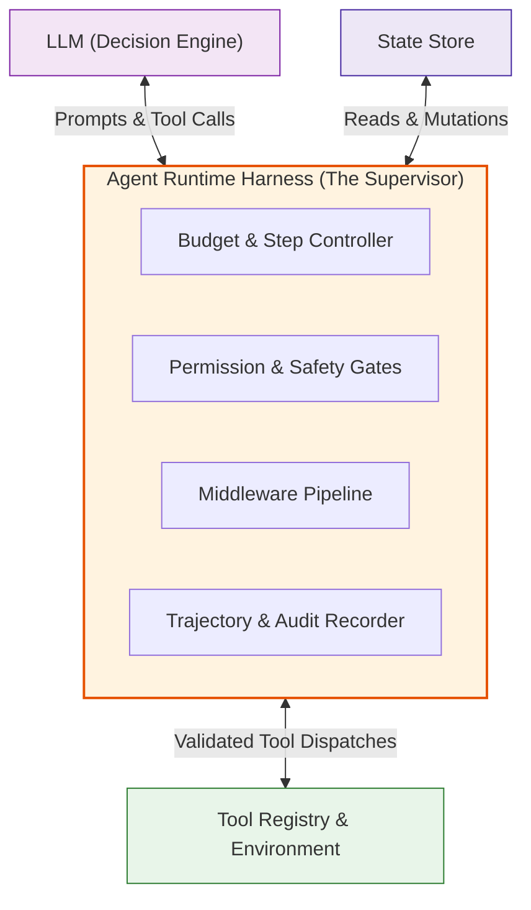

# Module 08: Agent Runtime and Harness

**Difficulty Level:** Level 3 — Systems 
**Focus:** The Agent Harness as the Operating System for the Model—managing budgets, permissions, middleware, error recovery, and trajectory recording.

---

## What You Will Learn

1. Why the LLM is only the *decision engine* and the **Agent Runtime / Harness** is the *operating system*.
2. The critical division of responsibilities:
   - **Model**: *"What should I do next?"*
   - **Runtime**: *"Are you allowed to do it? How is it executed? What state changed? Have you exceeded your token/step budget? Should execution halt?"*
3. How to build enterprise-grade runtime capabilities in pure Python:
   - **Step Limits & Execution Budgets**: Preventing infinite loops and billing blowouts.
   - **Tool Permission Gates & Approvals**: Blocking dangerous actions before execution.
   - **Middleware Hooks**: Before/after execution interceptors for logging, auditing, and transformation.
   - **Fault Tolerance & Retries**: Gracefully handling tool exceptions and timeouts.
   - **Full Trajectory Logging**: Audit trails for evaluation and debugging.

---

## The Runtime Architecture



---

## Module Contents

- **[concepts.md](concepts.md)**: Deep architectural analysis of runtimes, harnesses, middleware patterns, and budget enforcement.
- **[example.py](example.py)**: Production-style pure Python agent harness with step budgets, permission interceptors, and trajectory logging.
- **[exercise.md](exercise.md)**: Add human-in-the-loop approval middleware for high-risk tools.

---

## Quick Run

```bash
python 08-agent-runtime-and-harness/example.py
```
