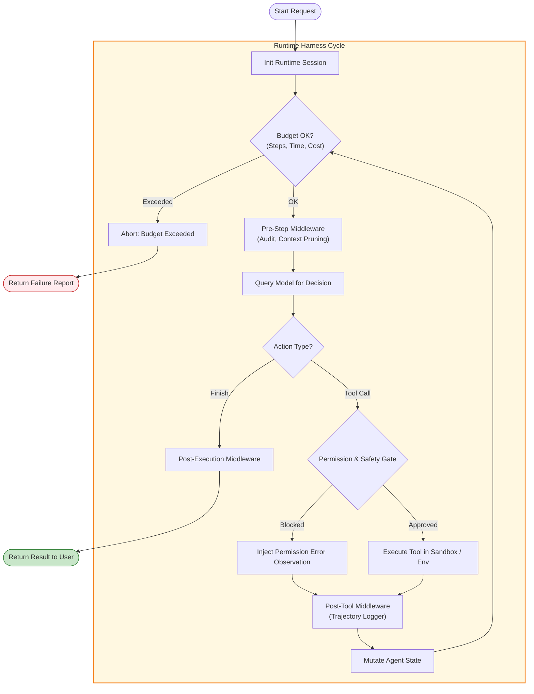

# Concepts: The Agent Runtime and Harness

A widespread misconception among beginners is believing the LLM manages the execution lifecycle. In truth, the model is merely a stateless calculation function. The **Agent Harness** is the operating system that makes autonomous execution feasible, controllable, and secure.

---

## 1. What Is It?

The **Agent Runtime / Harness** is the supervisory software container that wraps the model, manages state transitions, executes tools, enforces safety policies, logs trajectories, and controls execution termination.

| What the Model Decides | What the Runtime Enforces |
| :--- | :--- |
| *"What tool should I call?"* | *"Is this tool registered and permitted for this user?"* |
| *"What arguments should I use?"* | *"Do these arguments match the JSON schema?"* |
| *"Should I continue or stop?"* | *"Have you exceeded your maximum step or token budget?"* |
| *"What is my final answer?"* | *"Has the output been sanitized and verified?"* |

---

## 2. Why Does It Exist?

If you run an LLM directly in a raw while loop without a harness:
- A prompt injection or looping hallucination will burn thousands of dollars in API credits.
- A tool that throws an uncaught exception (`ConnectionResetError`, `KeyError`) will crash the entire service.
- Destructive commands (`rm -rf /` or `DROP TABLE users`) will execute without human approval or sandbox isolation.
- You have zero telemetry on why the agent took a specific trajectory or how long steps took.

The harness exists to provide **safety, observability, resilience, and determinism** around an inherently non-deterministic model.

---

## 3. How Does It Work?



---

## 4. Minimal Code Example: The Harness Pattern

```python
class AgentHarness:
    def __init__(self, model, registry, max_steps: int = 10, max_cost_usd: float = 0.50):
        self.model = model
        self.registry = registry
        self.max_steps = max_steps
        self.max_cost_usd = max_cost_usd
        self.current_cost = 0.0

    def run(self, goal: str) -> dict:
        state = {"goal": goal, "history": [], "step": 0}
        
        while state["step"] < self.max_steps:
            state["step"] += 1
            
            # 1. Budget Gate
            if self.current_cost > self.max_cost_usd:
                return {"status": "aborted", "reason": "Cost budget exceeded"}
            
            # 2. Decision
            decision = self.model.decide(state)
            if decision["type"] == "finish":
                return {"status": "success", "result": decision["answer"]}
            
            # 3. Permission & Safety Gate
            if decision["tool"] in ["delete_database", "execute_raw_shell"]:
                if not self.ask_human_permission(decision):
                    state["history"].append({"error": "Action rejected by supervisor policy"})
                    continue
            
            # 4. Sandboxed Execution & Trajectory Recording
            result = self.registry.execute(decision["tool"], decision["args"])
            state["history"].append({"step": state["step"], "result": result})

        return {"status": "aborted", "reason": "Maximum steps exceeded"}
```

---

## 5. Common Misconceptions

> No **Misconception**: *"Frameworks like LangGraph are replacement models."* 
> **Reality**: LangGraph is a runtime harness. It is a state machine that orchestrates how states are updated and tools are executed around standard models.

> No **Misconception**: *"The agent harness only matters for complex multi-agent systems."* 
> **Reality**: Even a single-agent calculator needs a harness to enforce step bounds, trap division by zero, and log the execution trail.

---

## 6. Failure Modes

1. **Unbounded Recursion**: No step limit causing an endless loop when a tool returns unexpected output.
2. **Silent State Corruption**: A middleware modifying state in-place without copying or snapshotting, breaking rollback capabilities.
3. **Privilege Escalation**: The model fabricating a tool call with elevated parameters because the harness failed to check user access tokens before invocation.

---

## 7. Where It Appears in Real Systems

- **LangGraph Checkpointers & StateGraphs**: Manages persistence and transitions between nodes.
- **Anthropic Claude Computer Use / Workbench**: The desktop harness that captures screenshots, checks coordinates, and runs OS events.
- **Docker / E2B Code Interpreter Sandboxes**: The physical execution harness isolating untrusted model-generated code.
