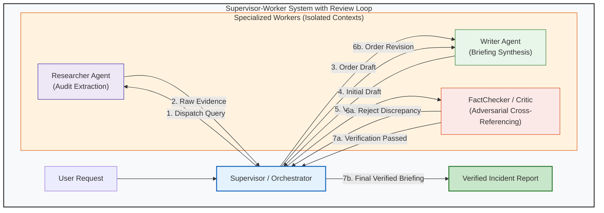

# Module 09: Multi-Agent Systems

**Difficulty Level:** Level 3 — Systems 
**Status:** Ready

---

## What You Will Learn

1. The primary multi-agent topologies: **Supervisor-Worker**, **Sequential Pipelines**, **Collaborative Meshes**, and **Debate/Consensus**.
2. Shared blackboard state vs. isolated point-to-point message-passing envelopes.
3. **When NOT to use multiple agents**: Why 80% of multi-agent use cases are more reliably and cost-effectively solved by a single focused agent with structured tools.
4. Structuring inter-agent handoff contracts, isolated specialist contexts, and turn ceilings.
5. Implementing arbitration loops, adversarial review gates, and termination rules.

---

## The Supervisor-Worker Review Architecture



---

## Core Questions This Module Answers

- *How do you pass tasks and findings cleanly between agents without losing critical operational details?*
- *What causes multi-agent deadlocks or infinite chatter loops, and how do you prevent them?*
- *When does adding a second agent increase error rates instead of accuracy?*
- *How do you enforce deterministic validation gates before an agent team publishes an artifact?*

---

## Module Contents

- **[concepts.md](concepts.md)**: Theoretical breakdown of the 4 topologies, shared state vs. message passing, the "Telephone Game" information loss, cost multipliers, and the justification checklist.
- **[example.py](example.py)**: Runnable pure Python demonstration of a Supervisor coordinating a Researcher, Writer, and FactChecker with automated rejection and revision cycles.
- **[exercise.md](exercise.md)**: Extend the system with an M-of-N consensus voting protocol and security veto power.

---

## Quick Run

```bash
python3 09-multi-agent-systems/example.py
```
