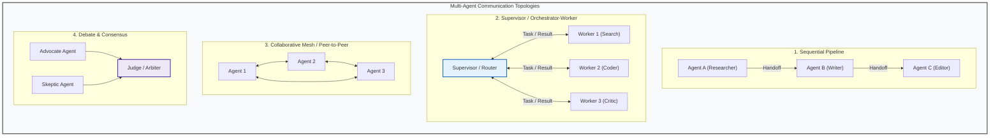

# Concepts: Multi-Agent Systems, Topologies, and Coordination

When a single agent is asked to perform multiple disparate tasks—such as searching documentation, writing code, executing unit tests, and verifying security policies—its context window becomes polluted with conflicting instructions, bloated histories, and noisy tool outputs.

A **Multi-Agent System (MAS)** addresses this by decomposing a complex goal across a network of **specialized, autonomous agents**, each operating with its own focused system prompt, isolated context window, and restricted toolset.

However, multi-agent systems introduce significant coordination complexity, message overhead, and new failure modes. Understanding **when and how** to coordinate multiple agents is the foundation of production multi-agent architecture.

---

## 1. Multi-Agent Topologies

Multi-agent architectures fall into four primary structural topologies:



### Topology 1: Sequential Pipeline
- **How it works**: Agent A completes its step and passes its final artifact to Agent B, which continues to Agent C.
- **Best for**: Well-defined, linear workflows (e.g. Ingestion $\to$ Summarization $\to$ Translation).
- **Limitation**: Inflexible; cannot easily loop back if an early stage contained an error.

### Topology 2: Supervisor / Orchestrator-Worker
- **How it works**: A central Supervisor agent decomposes the goal, assigns subtasks to specialized worker agents, reviews their findings, and coordinates revisions.
- **Best for**: Most production systems. Highly predictable, observable, and easy to debug.

### Topology 3: Collaborative Peer Mesh
- **How it works**: Agents communicate directly via an open message bus without a central authority.
- **Limitation**: Prone to chaotic coordination, infinite banter loops, and difficult-to-trace failures.

### Topology 4: Debate / Adversarial Consensus
- **How it works**: Multiple agents generate competing solutions or critiques, and a neutral Judge synthesizes the optimal path.
- **Best for**: High-stakes decisions, code security auditing, and fact verification.

---

## 2. Communication Models: Shared State vs. Message Passing

How do agents exchange information during execution?

```mermaid
flowchart LR
    subgraph ModelA["Model A: Shared Blackboard / State"]
        SA_Agent1["Agent 1"] <--> GlobalState["Shared State Dictionary<br/>(Task board, artifacts, memory)"]
        SA_Agent2["Agent 2"] <--> GlobalState
    end

    subgraph ModelB["Model B: Message Passing / Handoffs"]
        MB_Agent1["Agent 1"] -->|Envelope(sender, receiver, payload)| MB_Agent2["Agent 2"]
    end

    style ModelA fill:#f8f9fa,stroke:#333,stroke-width:1px
    style ModelB fill:#f8f9fa,stroke:#333,stroke-width:1px
    style GlobalState fill:#fff3e0,stroke:#e65100,stroke-width:2px
```

| Dimension | Shared State (Blackboard) | Message Passing (Handoffs) |
| :--- | :--- | :--- |
| **Mechanism** | Central dictionary/database mutated by all agents. | Structured message envelopes routed point-to-point. |
| **Context Isolation** | Low (Agents must filter shared state). | High (Each agent only sees what was explicitly addressed to it). |
| **Concurrency** | Requires race condition and locking management. | Naturally asynchronous and actor-based. |
| **Framework Analog** | LangGraph `StateGraph`, AutoGen Shared Blackboard. | OpenAI Agents SDK handoffs, Erlang actor model. |

---

## 3. The Counter-Intuitive Truth: When NOT to Use Multi-Agent

A widespread industry pitfall is immediately jumping to multi-agent architectures for every problem. In practice, **80% of multi-agent projects would be more reliable, faster, and cheaper as a single agent with well-designed tools**.

### Why Multi-Agent Systems Often Degrade Quality:
1. **The "Telephone Game" Information Loss**:
   Every time Agent A summarizes its work to hand off to Agent B, fine-grained details, file paths, and nuance are compressed or lost. By the time Agent D receives the task, critical context has evaporated.
2. **Exponential Token Costs & Latency**:
   $N$ agents chatting with each other means $N$ sequential or parallel model calls per user step. A 4-agent team often consumes $5\times$ to $10\times$ more tokens and takes $4\times$ longer than a single agent.
3. **Infinite Banter & Coordination Deadlock**:
   Without strict termination rules, agents frequently fall into polite confirmation loops:
   - *Agent A*: "I have finished the research. What do you think?"
   - *Agent B*: "Great job! Is there anything else you'd like me to check?"
   - *Agent A*: "No, everything looks good. How about you?"
   - *(Budget exhausted)*

### When Multi-Agent IS Justified (The Checklist):
- **Distinct Privilege Domains**: Agent A has read-only public access; Agent B has write access to production database requiring human confirmation.
- **Massive Context Separation**: Agent A processes 50,000 tokens of raw legal contracts; passing that full history to Agent B (the code writer) would induce context pollution.
- **Genuine Role Specialization**: A Generator agent and an adversarial Critic agent with conflicting optimization goals.
- **Parallel Independent Subtasks**: Scraping 5 different websites concurrently with independent workers.

---

## 4. Coordination & Termination Protocols

To make a multi-agent system deterministic and reliable:

1. **Clear Agent Contracts**:
   Every agent must output a structured envelope containing:
   - `status`: `"IN_PROGRESS"`, `"NEEDS_INFO"`, or `"DONE"`
   - `recipient`: Next target agent ID or `"SUPERVISOR"`
   - `content`: Explicit findings or request
2. **Turn Limits and Step Budgets**:
   Enforce a hard ceiling on inter-agent messages (e.g. `max_total_turns = 10`). If agents do not reach a conclusion within the budget, the supervisor forces termination with an error report.
3. **Supervisor Arbitration**:
   Workers should never declare the overall task complete. Only the Supervisor or Arbiter can terminate the system run and deliver the final answer to the user.
