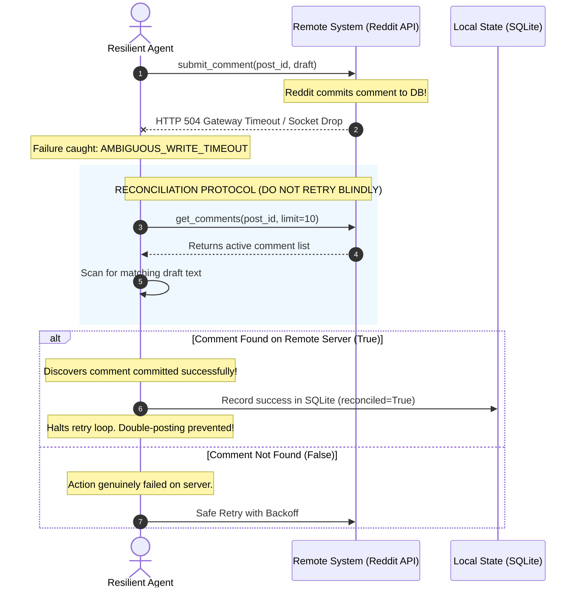

# Module 10: Agent Failures and Defensive Resilience

**Difficulty Level:** Level 4 — Production 
**Status:** Ready

---

## What You Will Learn

1. The core axiom of agent reliability: **A failed API call does not necessarily mean the action failed**.
2. The 5-Tier Failure Taxonomy: **Transient**, **Permanent**, **Ambiguous**, **Partial**, and **Semantic**.
3. Structured recovery protocols: **Retry**, **Backoff**, **Re-observe**, **Reconcile**, **Abort**, and **Escalate**.
4. Handling the 10 critical production failure modes (rate limits, deleted posts, semantic drift mid-flight, write timeouts, auth expiration).
5. Implementing **Reconciliation Loops**: Inspecting remote system state before attempting retries to prevent duplicate mutations.

---

## The Ambiguous Write Reconciliation Architecture



---

## The 10 Failure Modes Handled in This Module

| # | Scenario | Failure Class | Handling Strategy | Defense Implemented |
| :--- | :--- | :--- | :--- | :--- |
| **1** | **HTTP 429 Rate Limit** | Transient | Backoff & Retry | Parses `Retry-After: 0.1s`, pauses, retries. |
| **2** | **Post Deleted (HTTP 404)** | Permanent | Abort | Immediately halts, logs permanent failure, saves tokens. |
| **3** | **Post Edited Mid-Flight** | Semantic | Re-observe & Invalidate | Compares SHA-256 post hash; invalidates stale draft. |
| **4** | **Read Operation Timeout** | Transient | Bounded Retry | Safely retries idempotent read up to `max_retries`. |
| **5** | **Malformed API Response** | Partial | Schema Guard | Catches missing keys defensively without crashing loop. |
| **6** | **Local Crash / Write Timeout** | Ambiguous | **Reconcile First** | Queries remote comment tree; confirms publication. |
| **7** | **Duplicate Submission Attempt** | Permanent | Idempotency Check | Rejects second write with `DuplicateCommentError`. |
| **8** | **OAuth Token Expired (401)** | Transient | Refresh & Retry | Refreshes authentication token and retries request. |
| **9** | **Semantic Staleness** | Semantic | Timestamp Guard | Validates `created_utc` vs system clock before acting. |
| **10** | **Step Budget Exhaustion** | Permanent | Harness Tripwire | Halts cleanly when `max_retries` ceiling is reached. |

---

## Core Questions This Module Answers

- *Why does blind retrying on a network timeout cause duplicate comments and spam bans?*
- *How does an agent verify whether a remote write succeeded after the connection dropped?*
- *How do you detect when a user edited their question while the agent was drafting an answer?*
- *When should an agent retry vs. when must it abort immediately to save budget?*

---

## Module Contents

- **[concepts.md](concepts.md)**: Theoretical breakdown of the 5 failure classes, the 6 recovery strategies, and the mathematics of rate limit backoff.
- **[example.py](example.py)**: Runnable pure Python demonstration of fault injection, ambiguous write reconciliation, and semantic drift protection built directly on `RedditCommentAgent`.
- **[exercise.md](exercise.md)**: Extend the agent with client-side idempotency keys and server deduplication caches.

---

## Quick Run

```bash
python3 10-agent-failures/example.py
```
