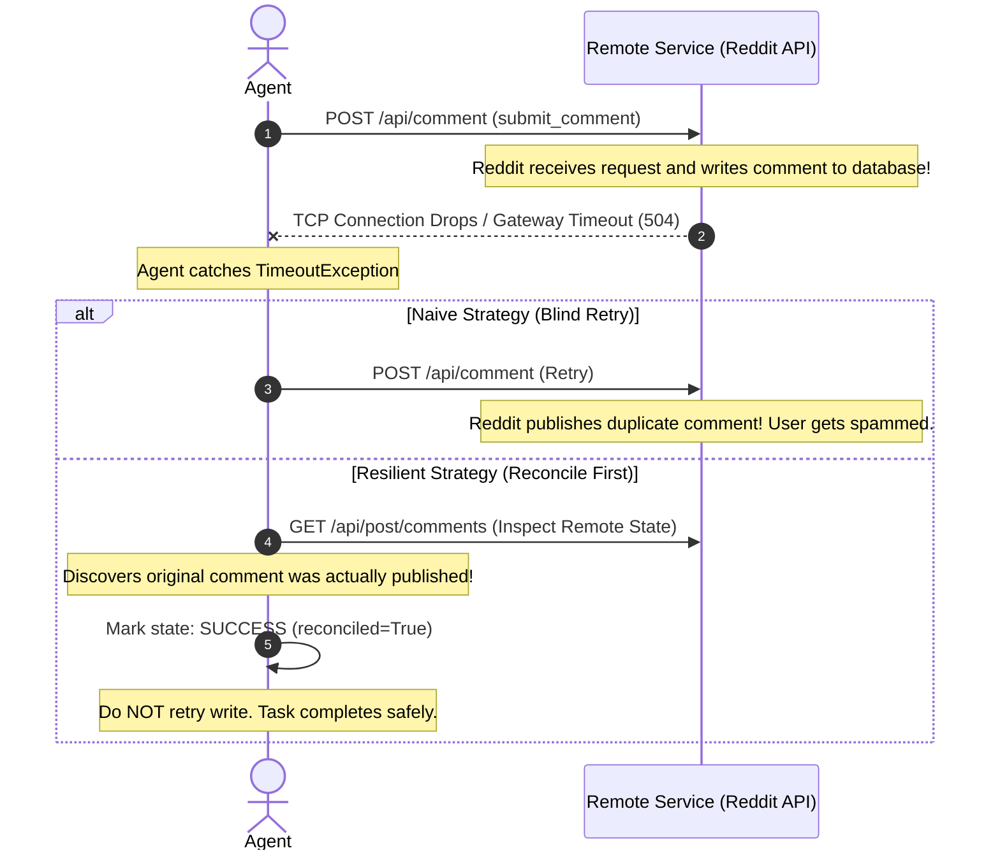
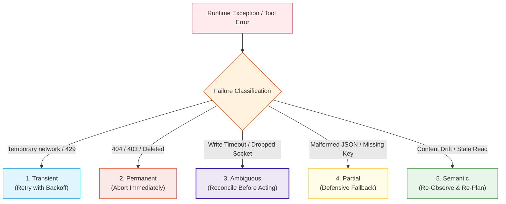

# Concepts: Agent Failure Taxonomy, Recovery Strategies, and Reconciliation

In a toy demo, APIs always succeed, networks never drop packets, and the environment remains static while the model thinks.

In real-world deployments, **failure is the default operational state**. APIs rate-limit requests, posts get deleted mid-flight, users edit questions while agents draft answers, and network sockets timeout during database writes.

Most catastrophic agent incidents (spamming loops, runaway billing, duplicate transactions, corrupted databases) stem from one fundamental mistake: **treating agent failures as simple Python exceptions that should either crash the program or be blindly retried.**

Production agents require a formal **Failure Taxonomy**, bounded **Handling Strategies**, and rigorous **Reconciliation Protocols**.

---

## 1. The Core Axiom of Agent Reliability

> **A failed API call does not necessarily mean the action failed.**

Consider an agent submitting a comment or executing a financial transaction:



If an agent blindly retries whenever it catches an exception, it turns every ambiguous network hiccup into a **duplicate write**.

---

## 2. The 5-Tier Failure Taxonomy

Failures are not created equal. Before deciding whether to retry, back off, or abort, the runtime must classify the failure into one of five categories:



| Failure Class | Definition | Real-World Examples | Safe Response |
| :--- | :--- | :--- | :--- |
| **1. Transient** | Temporary environment glitch that is likely to resolve itself shortly. | HTTP 429 (Rate Limit), HTTP 503 (Service Unavailable), Read timeout. | Exponential backoff respecting `Retry-After`. |
| **2. Permanent** | Deterministic error that will never succeed on retry without external code/permission changes. | HTTP 404 (Post Deleted), HTTP 403 (Account Banned), Invalid Subreddit. | **Abort immediately.** Do not waste retries or tokens. |
| **3. Ambiguous** | An unconfirmed state where the local client cannot know if a remote state mutation occurred. | Network socket timeout during `submit_comment`, HTTP 504 Gateway Timeout. | **Reconcile remote state first.** Query server before attempting any re-submission. |
| **4. Partial** | Response arrived but is missing expected structural fields or data is truncated. | Reddit JSON missing `selftext` or `author` set to `[deleted]`. | Schema validation, defensive defaults, fallback re-fetch. |
| **5. Semantic** | HTTP call returned 200 OK, but the external real-world context has changed. | Post edited by OP after agent observed it; question answered by someone else mid-draft. | **Re-observe before write.** Validate post hash before publishing draft. |

---

## 3. The 6 Recovery Strategies

When an agent encounters a failure, it routes through one of six structured recovery strategies:

1. **Retry (Bounded)**:
   - Only for idempotent read operations or operations with confirmed non-execution.
   - Hard limit: Never retry more than `max_retries = 3`.
2. **Backoff (Rate-Aware)**:
   - For 429 rate limits, parse the `Retry-After` response header.
   - If no header is provided, apply exponential backoff with jitter:
     $$t_{\text{wait}} = \text{base} \times 2^{\text{attempt}} + \text{random}(0, 1)$$
3. **Re-Observe**:
   - Before taking a final write action, re-fetch the target object (`read_post`) to check if the `selftext` or comment count changed. If state drifted, discard the draft and re-plan.
4. **Reconcile**:
   - The cornerstone of safe write operations. Inspect the remote system to determine if an ambiguous action actually completed.
5. **Abort**:
   - Cleanly terminate the subtask, release memory locks, update SQLite with the permanent failure reason, and exit.
6. **Escalate**:
   - Alert the human supervisor when an ambiguous failure cannot be resolved automatically or when safety boundaries are approached.

---

## 4. The 10 Scenarios Handled in This Module

Using our running `RedditCommentAgent` capstone, Module 10 implements concrete defenses for 10 specific production failure scenarios:

1. **Reddit 429 Rate Limit**: Agent parses `Retry-After: 0.1s`, pauses execution, and succeeds on backoff retry.
2. **Post Deleted Mid-Flight**: Agent attempts `read_post` on a deleted thread, receives 404, marks state as `PermanentFailure`, and skips cleanly without retrying.
3. **Post Edited During Drafting (Semantic Drift)**: Agent compares `post_hash` at observation vs. pre-submission. Detects that OP edited the question, invalidates the stale draft, and re-observes.
4. **Read Timeout**: `read_comments()` times out on attempt 1. Since read operations are idempotent, agent retries safely and succeeds.
5. **Malformed JSON Payload**: API returns an unexpected schema. Defensive parser catches missing keys without crashing the agent loop.
6. **Local Crash After Remote Success**: Reddit published the comment, but local database write failed. On restart, reconciliation detects the published comment and updates SQLite.
7. **Duplicate Submission Protection**: Agent checks local SQLite state and remote comment tree using idempotency keys, preventing double-posting.
8. **Auth Token Expiration (HTTP 401)**: Agent catches `AuthExpiredError`, triggers token refresh, and retries request.
9. **Semantic Staleness (Silent Outdated Data)**: API returns 200 OK with cached data; agent checks `created_utc` vs system clock.
10. **Step/Retry Budget Exhaustion**: Persistent transient errors reach `max_retries`. Agent halts cleanly via harness tripwire.

---

## 5. Structured Failure Trajectory Schema

Every failure event must be recorded in the agent's trajectory log with complete diagnostic metadata:

```python
@dataclass
class FailureRecord:
    action: str              # e.g. "submit_comment"
    attempt: int             # e.g. 1
    failure_type: str        # "TRANSIENT", "PERMANENT", "AMBIGUOUS", "PARTIAL", "SEMANTIC"
    error_message: str       # e.g. "HTTP 504 Gateway Timeout"
    retryable: bool          # True / False
    backoff_seconds: float   # e.g. 0.5
    reconciled: bool         # Was remote state inspected?
    final_outcome: str       # "RECOVERED", "RECONCILED_SUCCESS", "ABORTED"
```

This telemetry transforms failure handling from guessing into an observable engineering discipline.
