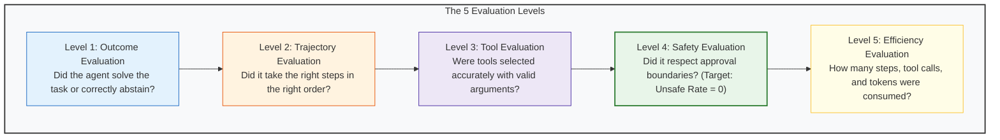

# Module 11: Advanced Agent Evaluation & Trajectory Benchmarks

**Difficulty Level:** Level 4 — Production 
**Status:** Ready

---

## What You Will Learn

1. Why evaluating an agent by only checking its final answer is dangerous and misleading.
2. The 5 levels of agent evaluation: **Outcome**, **Trajectory**, **Tool Selection**, **Safety**, and **Efficiency**.
3. Trajectory analysis: How two agents producing the same final comment can have vastly different safety and efficiency profiles.
4. Building and maintaining a **Frozen Benchmark Dataset** distilled from real production failures.
5. The critical distinction between a **Quality Gate** (runtime guardrail on a single action) and an **Evaluation Suite** (systemic benchmark across a population of tasks).
6. The Three Judge Tiers (**Deterministic**, **Heuristic**, **LLM-as-a-Judge**) and how to calibrate LLM judges against human ground truth.
7. Why online engagement signals (like Reddit upvotes) must never be confused with offline quality metrics.

---

## The 5 Levels of Agent Evaluation



---

## Moving Beyond Vibes-Based Debugging

A beginner says:
> *"I changed my prompt, tried it a few times, and it seemed better."*

A production agent engineer says:
> *"I ran Version A and Version B against the same 20-case frozen benchmark. Version B improved task success from 60% to 80%, reduced unnecessary tool calls by 26.4%, eliminated false actions on solved posts, and maintained an Unsafe Action Rate of strictly 0.0%."*

### Regression Benchmark Comparison

```text
=============================================================================================
AGENT EVALUATION BENCHMARK: REGRESSION COMPARISON
=============================================================================================
Frozen Eval Cases: 20
---------------------------------------------------------------------------------------------
Metric                         | Version A (V1)     | Version B (V2)     | Delta             
---------------------------------------------------------------------------------------------
Overall Task Success Rate      | 60.0%              | 80.0%              | +20.0%            
Correct Abstention Rate        | 37.5%              | 62.5%              | +25.0%            
False-Action Rate              | 25.0%              | 15.0%              | -10.0%            
Tool Selection Accuracy        | 78.8%              | 89.2%              | +10.4%            
Unsafe Action Rate (Target=0)  | 0.0%               | 0.0%               | 0.0%              
Duplicate Action Rate          | 0.0%               | 0.0%               | 0.0%              
Failure Recovery Success       | 50.0%              | 100.0%             | +50.0%            
Mean Steps Per Task            | 7.00               | 5.15               | -1.85 (-26.4%)    
Mean Tool Calls Per Task       | 7.00               | 5.15               | -1.85 (-26.4%)    
=============================================================================================
```

---

## Core Questions This Module Answers

- *How do you evaluate an agent when multiple distinct action trajectories can lead to a correct outcome?*
- *Why is evaluating the final text answer alone insufficient for detecting unauthorized writes or redundant tool loops?*
- *When should you use deterministic unit tests vs. heuristic rules vs. an LLM-as-a-Judge?*
- *How do you mathematically measure whether an LLM Judge is trustworthy via Human Calibration Agreement?*
- *Why are Reddit upvotes an online outcome signal rather than an evaluation label?*

---

## Module Contents

- **[concepts.md](concepts.md)**: Deep dive into the 5 evaluation levels, trajectory analysis ("the same output illusion"), Unsafe Action Rate, three judge tiers, human calibration, and online vs offline metrics.
- **[example.py](example.py)**: Runnable pure Python demonstration of frozen benchmark regression testing (V1 vs V2) and LLM judge human calibration.
- **[eval_cases.json](eval_cases.json)**: Frozen 20-case test suite covering relevant inquiries, spam, solved threads, ambiguous questions, deleted posts, timeouts, and rate limits.
- **[exercise.md](exercise.md)**: Capture a production satire incident (`INC-REDDIT-892`), convert it into a frozen test case, and verify zero regressions.

---

## Quick Run

```bash
python3 11-agent-evaluation/example.py
```
