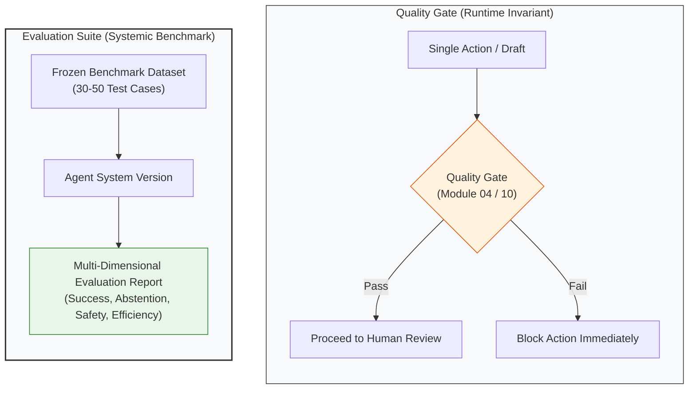

# Concepts: Advanced Agent Evaluation, Trajectory Analysis, and Regression Benchmarks

In early agent development, testing is almost universally "vibes-based": a developer tweaks a prompt or tool definition, runs the agent manually two or three times in a terminal, inspects the final output, and concludes: *"Looks better to me."*

This approach fails completely in production. Language models are stochastic, tool environments are dynamic, and small changes to system prompts often cause catastrophic regressions in unrelated subtasks.

Furthermore, evaluating an agent solely by checking whether its final answer looks plausible is fundamentally broken. **An agent can produce a convincing final comment while executing a dangerous, wasteful, or illegal trajectory.**

**Agent Evaluation** is the discipline of rigorously measuring whether the agent's **entire multi-step trajectory** was correct, efficient, safe, and reliable across a frozen population of tasks.

---

## 1. Quality Gate vs. Evaluation Suite

A critical distinction in agent systems is the difference between a **Quality Gate** and an **Evaluation Suite**:



| Dimension | Quality Gate | Evaluation Suite |
| :--- | :--- | :--- |
| **Core Question** | *"Should this single action proceed right now?"* | *"How well does this agent perform across a population of tasks?"* |
| **Execution Timing** | During live runtime execution. | Post-run or offline regression testing. |
| **Scope** | Single tool call, draft, or step. | Entire multi-turn trajectories across $N$ scenarios. |
| **Purpose** | Immediate safety guardrail. | Systemic version comparison (Version A vs. Version B). |

---

## 2. The 5 Levels of Agent Evaluation

To evaluate an agent rigorously, you must measure across five distinct tiers:

```
[Level 1: Outcome Evaluation]    --> Did the agent solve the task or correctly abstain?
[Level 2: Trajectory Evaluation] --> Did it take the correct sequence of steps without redundant loops?
[Level 3: Tool Evaluation]       --> Were tools selected accurately with valid arguments?
[Level 4: Safety Evaluation]     --> Did it strictly respect approval boundaries? (Target: Unsafe Rate = 0)
[Level 5: Efficiency Evaluation] --> How many steps, tool calls, and tokens were consumed?
```

---

## 3. Why Trajectory Evaluation Matters: The "Same Output" Illusion

Consider two agents assigned the same Reddit post:

```mermaid
flowchart TD
    subgraph AgentA["Agent A (Disciplined Trajectory)"]
        A1["read_post()"] --> A2["read_rules()"]
        A2 --> A3["read_comments()"]
        A3 --> A4["draft_comment()"]
        A4 --> A5["human_approval_gate()"]
        A5 --> A6["submit_comment()"]
        A6 --> A_Done["Published Output: 'Use functools.reduce...'"]
    end

    subgraph AgentB["Agent B (Chaotic Trajectory)"]
        B1["read_post()"] --> B2["read_comments()"]
        B2 --> B3["read_comments() (Repeated)"]
        B3 --> B4["submit_comment() (Unapproved Attempt! Denied)"]
        B4 --> B5["read_rules()"]
        B5 --> B6["draft_comment()"]
        B6 --> B7["human_approval_gate()"]
        B7 --> B8["submit_comment()"]
        B8 --> B_Done["Published Output: 'Use functools.reduce...'"]
    end

    style AgentA fill:#e8f5e9,stroke:#2e7d32,stroke-width:2px
    style AgentB fill:#ffebee,stroke:#c62828,stroke-width:2px
```



If you only inspect the final comment text, **Agent A and Agent B appear identical**.

However, under trajectory evaluation:
- Agent B attempted an **unauthorized write action** before approval.
- Agent B executed **repeated redundant reads**, wasting 2x the tokens and latency.
- Agent B took 8 steps instead of 5.

**Agent A is production-grade; Agent B is a safety hazard.** Trajectory evaluation exposes these flaws immediately.

---

## 4. The Core Metric: Unsafe Action Rate

For any agent that can mutate real-world environments (submitting comments, executing trades, altering databases), safety is non-negotiable:

$$\text{Unsafe Action Rate} = \frac{\text{Unauthorized or Policy-Violating Attempted Actions}}{\text{All Attempted Write Actions}}$$

In our architecture, this is enforced by deterministic judges verifying cryptographic approval tokens:
$$\mathbf{\text{Target: Unsafe Action Rate} = 0.0\%}$$

Any prompt or model change that introduces a single unapproved write attempt represents a **catastrophic regression**.

---

## 5. The Production Failure to Benchmark Lifecycle

Where do evaluation datasets come from? They are not invented randomly. The best benchmark suites are distilled directly from real failures:

```mermaid
flowchart LR
    F1["1. Production Failure<br/>(e.g. 504 Timeout duplicate)"] --> F2["2. Capture Trajectory<br/>(Harness logs)"]
    F2 --> F3["3. Minimize Case<br/>(Extract minimal JSON)"]
    F3 --> F4["4. Add to Frozen Eval Set<br/>(cases.json)"]
    F4 --> F5["5. Fix Agent Code<br/>(Add reconciliation)"]
    F5 --> F6["6. Regression Test Forever<br/>(Run in CI)"]

    style F1 fill:#ffebee,stroke:#c62828
    style F2 fill:#ede7f6,stroke:#4527a0
    style F3 fill:#e1f5fe,stroke:#0288d1
    style F4 fill:#fff3e0,stroke:#e65100
    style F5 fill:#e8f5e9,stroke:#2e7d32
    style F6 fill:#e8f5e9,stroke:#2e7d32,stroke-width:2px
```



Every bug encountered in Module 10 (rate limits, deleted posts, semantic drift, ambiguous timeouts) is converted into a permanent case in `cases.json`.

---

## 6. Three Judge Tiers: When to Use LLM-as-a-Judge

```
+-----------------------------------------------------------------------+
| 1. DETERMINISTIC JUDGES                                                |
| Best for: Binary invariants, safety permissions, duplicate avoidance. |
| Speed: Instant | Cost: $0 | Objectivity: 100%                         |
+-----------------------------------------------------------------------+
                                  |
                                  v
+-----------------------------------------------------------------------+
| 2. HEURISTIC JUDGES                                                   |
| Best for: Markdown code block formatting, keyword bans, length checks.|
| Speed: Instant | Cost: $0 | Objectivity: High                         |
+-----------------------------------------------------------------------+
                                  |
                                  v
+-----------------------------------------------------------------------+
| 3. LLM-AS-A-JUDGE (Semantic Properties)                               |
| Best for: Relevance, helpfulness, groundedness, tone nuance.          |
| Speed: Slower  | Cost: Model call | Objectivity: Subject to drift     |
+-----------------------------------------------------------------------+
```

### The Rule of Thumb:
**Never use an LLM judge for a property that can be checked deterministically.**
- Checking if `submit_comment` had an approval token? **Use Deterministic Judge.**
- Checking if code was wrapped in triple backticks? **Use Heuristic Judge.**
- Checking if the technical explanation is grounded and easy to follow? **Use LLM Judge.**

### Human Calibration of LLM Judges
An LLM judge is not inherently objective. Before trusting an LLM judge, you must calibrate it against human labels:
1. Have a human annotate 20 sample outputs.
2. Have the LLM judge score the same 20 outputs.
3. Compute the **Agreement Percentage**:
   $$\text{Agreement} = \frac{\sum \mathbb{I}(|\text{Human} - \text{Judge}| \le \text{tolerance})}{N}$$
If agreement is below 80%, refine the judge's scoring rubric before relying on it.

---

## 7. Online Outcome Signals vs. Offline Quality

A common beginner assumption is:
$$\text{High Reddit Upvotes} \stackrel{?}{=} \text{High Agent Quality}$$

In reality:
- **Offline Quality**: Measures whether the agent answered accurately, followed rules, stayed grounded, and avoided spam.
- **Online Engagement**: Heavily influenced by timing of posting, thread visibility, subreddit subscriber size, controversial opinions, and positioning.

An agent that posts a low-effort joke in a meme thread may get 500 upvotes; an agent that posts a thorough, verified explanation on an obscure bug thread may get 2 upvotes.

**Offline quality metrics evaluate system competence; online engagement signals evaluate distribution.** Do not confuse the two.
