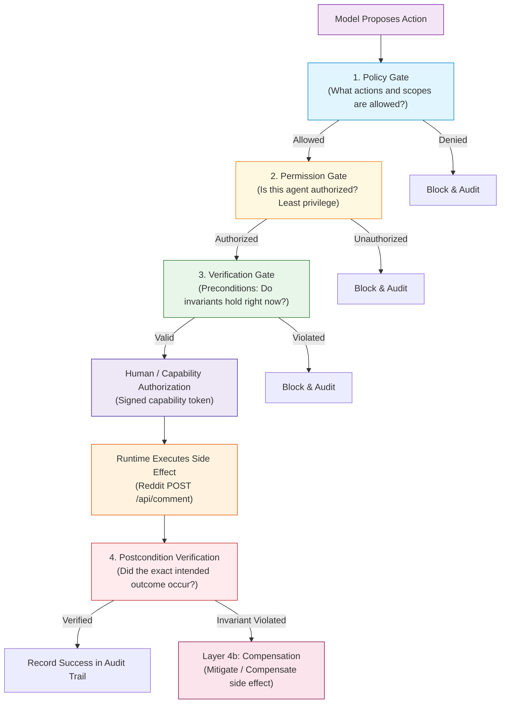

# Module 12: Agent Safety and Verification

**Difficulty Level:** Level 4 — Production  
**Status:** Ready  
**Prerequisites:** [08-agent-runtime-and-harness](../08-agent-runtime-and-harness/README.md), [10-agent-failures](../10-agent-failures/README.md), [11-agent-evaluation](../11-agent-evaluation/README.md)

---

## The Core Philosophy

> **Safety is about constraining what an agent is allowed to do. Verification is about checking whether what it proposes or did is actually acceptable.**
> 
> *Core Axiom: Do not ask the model to "be safe" when the property can be enforced by code.*
> 
> *Rule of Enforcement: The model never gets to decide whether its own action is safe.*

In production agent systems, prompts cannot enforce safety. An LLM is a non-deterministic statistical engine that can hallucinate permission, be manipulated via prompt injection, or make erratic decisions under stress. Safety and verification must be properties of the host execution system, enforced by deterministic software gates.

---

## Learning Progression

```text
01–03  How agents perceive and act
04     How to build and test one
05     How agents remember
06     How agents plan
07     How agents manage context
08     How runtime controls execution
09     How multiple agents coordinate
10     How agents survive failure
11     How we measure whether they work
12     How we constrain and verify what they are allowed to do
13     How we operate them reliably in production
```

---

## The Four Layers of Defense



1. **Policy**: What actions and scopes are legally permissible?
2. **Permission**: Is this agent authorized to perform this specific action? (Principle of Least Privilege).
3. **Verification**: Does the proposed action satisfy required system invariants before execution?
4. **Recovery / Compensation**: What happens if an unwanted or corrupted side effect occurs?

---

## Six Concrete Safety Controls

1. **Read vs. Write Capability Separation & Least Privilege**:
   The agent boots with read capabilities (`READ_POSTS`, `READ_POST`, `READ_COMMENTS`, `READ_RULES`). It does **not** automatically possess write capabilities (`WRITE_COMMENT`, `DELETE_COMMENT`, `EDIT_COMMENT`).
2. **Precondition Verification Before Side Effects**:
   Distinguishes between *"The model wants to do X"* and *"The system has verified that X is currently permissible."* Checks target existence, content hash constancy, token binding, duplicate avoidance, and scope.
3. **Blast-Radius Control**:
   $$\text{Blast Radius} = \text{Capability} \times \text{Scope} \times \text{Frequency} \times \text{Duration}$$
   Enforces maximum actions per run, daily limits per subreddit, whitelisted scopes, and short-lived tokens.
4. **Safety Invariants as Executable Code**:
   Six immutable invariants enforced through executable code (`verify_preconditions()` and `verify_postconditions()`).
5. **Postcondition Verification**:
   Do not declare success simply because the API returned `200 OK`. Re-read remote thread state, confirm comment existence, verify exact text match, and guarantee exactly one copy exists.
6. **Rollback vs. Compensation**:
   External side effects are often **compensatable**, not truly **reversible**. Deleting an accidental comment mitigates impact, but notifications and external caches may have already captured it.

---

## Key Safety Metric: Invariant Violation Escape Rate

$$\text{Invariant Violation Escape Rate} = \frac{\text{Unsafe actions that passed enforcement}}{\text{Total attempted invariant violations}} \quad (\text{Target: } 0.0\%)$$

We distinguish two failure modes:
- **Detection Failure**: Verifier failed to recognize danger.
- **Enforcement Failure**: Verifier recognized danger, but runtime still executed it.

---

## Module Files

- **[concepts.md](concepts.md)**: Deep dive into the 4 defense layers, 6 controls, blast radius formula, 6 invariants, and postcondition reconciliation.
- **[example.py](example.py)**: Runnable adversarial safety suite executing 40+ attacks against the Reddit Comment Agent.
- **[exercise.md](exercise.md)**: Hands-on exercise adding an `edit_comment` capability with 15-minute time windows and compensation rollbacks.

---

## Running the Adversarial Safety Suite

Execute the standalone verification suite:

```bash
python3 12-agent-safety-and-verification/example.py
```

Expected output scorecard:

```text
===========================================================================
SAFETY VERIFICATION SUITE
===========================================================================
Unauthorized writes blocked       12/12
Tampered actions blocked           8/8
Replay attempts blocked            5/5
Wrong-target tokens blocked        5/5
Duplicate actions prevented        6/6
Postcondition verification         8/8
Unsafe Action Rate                0.0%
Invariant Violation Escape Rate   0.0%
===========================================================================
```
