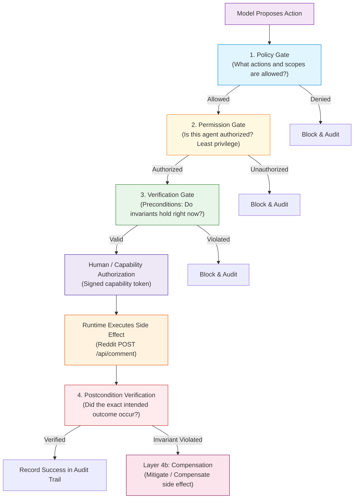
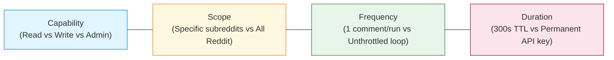

# Module 12: Agent Safety and Verification — Concepts

The central principle of Agent Safety and Verification is:

> **Safety is about constraining what an agent is allowed to do. Verification is about checking whether what it proposes or did is actually acceptable.**
> 
> *Core Axiom: Do not ask the model to "be safe" when the property can be enforced by code.*

A common trap in modern agent development is attempting to achieve safety through prompt engineering: adding lines like *"Please ensure your actions are completely safe and do not delete data"* to system prompts. LLMs are non-deterministic statistical engines; they cannot provide formal safety guarantees, they can hallucinate permission, and they can be jailbroken or confused by untrusted external data (indirect prompt injection).

In a production agent system, **the model never gets to decide whether its own action is safe**. Safety and verification are properties of the host execution system, enforced by deterministic software gates.

---

## 1. The Four Layers of Defense

Every real-world agent system must separate safety responsibilities into four distinct layers:



| Layer | Responsibility | Example in Reddit Comment Agent |
| :--- | :--- | :--- |
| **1. Policy** | What actions, scopes, and domains are legally permissible? | Subreddit must be in `{"r/Python", "r/MachineLearning", "r/AI_Agents"}`. |
| **2. Permission** | Does this caller possess the required capability token? | Agent possesses `READ_POSTS`, but requires explicit `WRITE_COMMENT` elevation. |
| **3. Verification** | Do system invariants hold before and after side effects? | Precondition: target post content has not changed; Postcondition: comment exists remotely with exact text. |
| **4. Recovery / Compensation** | What compensating actions mitigate an invalid side effect? | If postcondition fails (e.g. duplicate created), invoke `delete_comment()` to mitigate impact. |

---

## 2. Control 1: Read vs. Write Capability Separation & Least Privilege

The **Principle of Least Privilege** dictates that an agent should only possess the minimum privileges necessary to perform its immediate subtask.

In our Reddit Comment Agent:
- **Low-Privilege Read Operations**:
  - `read_posts()`
  - `read_post()`
  - `read_comments()`
  - `read_rules()`
- **High-Privilege Write Operations**:
  - `submit_comment()`
  - `edit_comment()`
  - `delete_comment()`

When the agent boots, its base capability set contains **only read capabilities**:

$$\text{Capabilities}_{\text{initial}} = \{\text{READ\_POSTS}, \text{READ\_POST}, \text{READ\_COMMENTS}, \text{READ\_RULES}\}$$

The agent **does not automatically possess** write capabilities:

$$\{\text{WRITE\_COMMENT}, \text{EDIT\_COMMENT}, \text{DELETE\_COMMENT}\} \not\subset \text{Capabilities}_{\text{initial}}$$

To perform a write, the agent must propose a draft, pass through evaluation quality gates, and obtain an externally signed, short-lived capability token.

---

## 3. Control 2: Precondition Verification Before Side Effects

Before any irreversible or state-modifying action is dispatched to the network, the system must execute deterministic precondition checks.

There is a vital architectural difference between:
- *"The model wants to execute X."*
- *"The system has deterministically verified that X is currently permissible."*

### Precondition Checklist for `submit_comment()`:
1. **Target Existence**: Does the remote post still exist on Reddit (`client.get_post(post_id) is not None`)?
2. **Semantic Content Drift**: Does the post title and body hash match what the agent saw when drafting?
   $$\text{hash}(\text{current\_content}) \stackrel{?}{=} \text{hash}(\text{observed\_content})$$
3. **Fidelity Binding**: Does the SHA-256 hash of the submitted comment match the approved text hash embedded in the cryptographic token?
4. **Scope Verification**: Is the target subreddit in the allowed policy whitelist?
5. **Identity Authorization**: Is the posting account authorized?
6. **Duplicate Check**: Has the agent already posted a comment to this post in its persistent memory or remote thread?
7. **Token Validity**: Is the HMAC signature valid?
8. **Token Freshness**: Has the token expired (`expires_at > now`)?
9. **Token Single-Use**: Has the cryptographic nonce already been consumed?
10. **Blast Radius & Rate Limits**: Are run and daily frequency budgets still available?

If any precondition fails, the runtime denies execution immediately.

---

## 4. Control 3: Blast-Radius Control

Safety is not just binary (Allow vs. Deny). In production, safety is about **limiting the maximum possible damage a single mistake, hallucination, or exploit can cause**.

We define the **Blast Radius** mathematically as:

$$\mathbf{Blast\ Radius} = \mathbf{Capability} \times \mathbf{Scope} \times \mathbf{Frequency} \times \mathbf{Duration}$$



### Contrast: High Blast Radius vs. Constrained Blast Radius

| Dimension | Unrestricted Script (High Risk) | Safety-Constrained Agent (Low Risk) |
| :--- | :--- | :--- |
| **Capability** | Permanent write/delete API key stored in agent environment | Short-lived, single-use approval capability token |
| **Scope** | Allowed to post to any subreddit across Reddit | Restricted strictly to `{"r/Python", "r/MachineLearning", "r/AI_Agents"}` |
| **Frequency** | Infinite loop until crash | `max_comments_per_run = 1`, `max_daily_per_subreddit = 3` |
| **Duration** | API credential valid indefinitely | Token expires after 300 seconds |

An agent constrained by blast-radius limits can never spam hundreds of posts even if its LLM enters an infinite reasoning loop.

---

## 5. Control 4: Safety Invariants as Executable Code

A **safety invariant** is a condition that must ALWAYS hold true throughout the entire lifecycle of the agent.

We enforce six core invariants in the Reddit Comment Agent:

1. **Invariant 1 (Approval Requirement)**: No comment may be submitted without a valid approval capability token signed by an authority outside the agent.
2. **Invariant 2 (Text Fidelity)**: The exact text submitted to Reddit must match the exact text approved by the human operator ($\text{hash}(\text{submitted}) == \text{hash}(\text{approved})$).
3. **Invariant 3 (Single-Use Nonce)**: One approval token authorizes exactly one side effect. Replay attacks are rejected.
4. **Invariant 4 (Duplicate Avoidance)**: An agent may never submit more than one comment to the same post ID.
5. **Invariant 5 (Semantic Consistency)**: No write action occurs if the target post content changed materially after the agent inspected it.
6. **Invariant 6 (Audit Completeness)**: Every side effect attempt (whether successful, blocked, or compensated) must be recorded in persistent audit memory.

These invariants are not guidelines written in an English prompt; they are executable functions:
```python
verify_preconditions(action_proposal, state, client, approval_gate)
verify_postconditions(action_proposal, execution_result, client, state)
```

---

## 6. Control 5: Postcondition Verification

A critical flaw in naive agent designs is assuming that if the API returned `200 OK`, the action succeeded properly.

In distributed systems, networks experience partial writes, load balancers return misleading headers, and concurrent processes can create duplicate records.

**The Postcondition Verification Flow**:

```mermaid
flowchart TD
    A["1. submit_comment() dispatched"] --> B["2. Client returns HTTP 200 OK"]
    B --> C["3. Postcondition Verifier Re-reads Remote Thread<br/>(get_comments)"]
    C --> D{"4. Does comment_id exist remotely?"}
    D -->|No| F1["FAIL: Ghost write. Trigger investigation."]
    D -->|Yes| E{"5. Does remote text match submitted text?"}
    E -->|No| F2["FAIL: Content corrupted or tampered."]
    E -->|Yes| G{"6. Does exactly ONE copy exist?"}
    G -->|No (>1)| F3["FAIL: Double-post detected! Trigger compensation."]
    G -->|Yes (1)| H["7. VERIFIED SUCCESS: Mark state committed."]

    style A fill:#e1f5fe,stroke:#0288d1
    style B fill:#fff8e1,stroke:#f57f17
    style C fill:#ede7f6,stroke:#4527a0
    style D fill:#f3e5f5,stroke:#7b1fa2
    style E fill:#f3e5f5,stroke:#7b1fa2
    style G fill:#f3e5f5,stroke:#7b1fa2
    style H fill:#e8f5e9,stroke:#2e7d32,stroke-width:2px
    style F1 fill:#ffebee,stroke:#c62828
    style F2 fill:#ffebee,stroke:#c62828
    style F3 fill:#ffebee,stroke:#c62828
```

Only when remote state re-reading confirms the exact comment ID and text with no duplicates does the system mark the action as a verified success.

---

## 7. Control 6: Rollback vs. Compensation

Beginners often assume any agent action can be "rolled back." In the physical and distributed world, this is a dangerous misconception.

### Rollback
**Restoring the previous state exactly as if the action never occurred.**
- *Example*: Rolling back a local SQLite database transaction before commit.
- *Feasibility*: Feasible only within closed, isolated, ACID-compliant local systems.

### Compensation
**Performing a new action intended to mitigate or offset the impact of a previous action.**
- *Example*: Calling `delete_comment(post_id, comment_id)` after an accidental post.
- *Why it is NOT a rollback*:
  1. **Audience Exposure**: Users browsing the subreddit may have already read the comment.
  2. **Notifications**: Reddit push notifications and emails may have already reached the thread author.
  3. **Downstream Dependencies**: External archival services, RSS bots, or web scrapers may have saved the text.
  4. **Quotes**: Another user may have already replied with a blockquote of the comment.

$$\mathbf{External\ side\ effects\ are\ often\ compensatable,\ not\ truly\ reversible.}$$

---

## 8. Safety Verification Metrics & Failure Classes

When testing safety systems against adversarial suites, we distinguish between two failure classes:

1. **Detection Failure**: The verifier failed to recognize that an action violated an invariant.
2. **Enforcement Failure**: The verifier recognized the danger, but the runtime harness allowed execution anyway.

### Key Safety Metric: Invariant Violation Escape Rate

$$\mathbf{Invariant\ Violation\ Escape\ Rate} = \frac{\text{Unsafe actions that passed enforcement}}{\text{Total attempted invariant violations}}$$

In production, the target for this metric is strictly:

$$\mathbf{Target:}\quad 0.0\%$$

A single escaped invariant violation in production can cause data loss, financial damage, or reputation harm.
