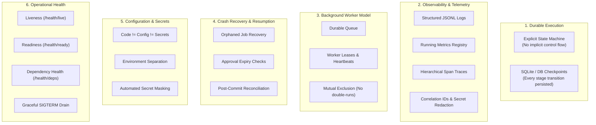

# Module 13: Production Agents

**Difficulty Level:** Level 4 — Production  
**Status:** Ready  
**Prerequisites:** [08-agent-runtime-and-harness](../08-agent-runtime-and-harness/README.md), [10-agent-failures](../10-agent-failures/README.md), [11-agent-evaluation](../11-agent-evaluation/README.md), [12-agent-safety-and-verification](../12-agent-safety-and-verification/README.md)

---

## The Core Philosophy

> **A production agent is not just an agent that works. It is an agent that can be observed, resumed, controlled, upgraded, and recovered while real work is happening.**
> 
> *Core Axiom: Production readiness is not "can the agent run?" It is "can the system keep operating correctly when processes crash, dependencies fail, workers restart, and versions change?"*

In a prototype, an agent is an ephemeral script running in a terminal. If the network drops, the process crashes, or a human takes 30 minutes to review a proposed draft, in-memory state vanishes and work is lost.

In production, agents must operate as **durable, asynchronous distributed services**.

---

## Learning Progression

```text
01–03  How agents perceive and act
04     How to build and test one
05     How agents remember
06     How agents plan
07     How agents manage context
08     How runtime controls execution
09     How multiple agents coordinate
10     How agents survive failure
11     How we measure whether they work
12     How we constrain and verify what they are allowed to do
13     How we operate them reliably in production
```

---

## Six Production Concerns



1. **Durable Execution & Explicit State Machine**:
   Replaces implicit control flow with verified state transitions:
   `QUEUED -> DISCOVERING -> INSPECTING -> DRAFTING -> EVALUATING -> WAITING_FOR_APPROVAL -> READY_TO_EXECUTE -> EXECUTING -> VERIFYING -> SUCCEEDED`.
2. **Background Worker Model & Durable Queue**:
   Scheduler enqueues work into SQLite; autonomous workers acquire exclusive leases with periodic heartbeats. Two workers can never execute the same job simultaneously.
3. **Crash Recovery & Post-Commit Reconciliation**:
   If a worker crashes after Reddit commits a write, the restarting agent reconciles remote state instead of creating a duplicate post.
4. **Three Pillars of Observability**:
   - **Logs**: JSONL with correlation tuples `(run_id, job_id, trace_id, action_id)`.
   - **Metrics**: Running rates (`agent_runs_total`, `comments_submitted_total`, `reconciliation_total`).
   - **Traces**: Latency waterfalls displaying execution spans.
5. **Configuration, Secrets & Redaction**:
   `Code != Configuration != Secrets`. Environment separation and automatic recursive secret masking.
6. **Operational Health Probes & Graceful Shutdown**:
   Liveness (`/health/live`), Readiness (`/health/ready`), and Dependency Health (`/health/deps`) HTTP endpoints, plus graceful `SIGTERM` drain handlers.

---

## Module Files

- **[concepts.md](concepts.md)**: Deep dive into the 6 production concerns, explicit state machine transitions, worker leases, reconciliation, and telemetry.
- **[example.py](example.py)**: Runnable demonstration of worker leasing, simulated crash recovery, post-commit reconciliation, and observability waterfalls.
- **[exercise.md](exercise.md)**: Hands-on exercise on incident root-cause analysis (`INC-REDDIT-LATENCY-402`) and implementing graceful `SIGTERM` draining.

---

## Running the Production Demonstration

Run the standalone standard library Python demonstration:

```bash
python3 13-production-agents/example.py
```

Expected terminal output:

```text
===========================================================================
PRODUCTION AGENT DEMO: DURABLE EXECUTION & CRASH RECOVERY
===========================================================================

RUN-1042 created
Worker-1 claimed job
Checkpoint: DRAFTING
Checkpoint: WAITING_FOR_APPROVAL
Approval received
Checkpoint: READY_TO_EXECUTE

SIMULATED WORKER CRASH
Worker-1 lease expired
Worker-2 reclaimed RUN-1042
Recovered checkpoint: READY_TO_EXECUTE
Remote reconciliation: no existing comment
Executing approved write
Postcondition verified

RUN-1042 -> SUCCEEDED

Duplicate writes: 0
Lost runs: 0
Safety violations: 0
```
