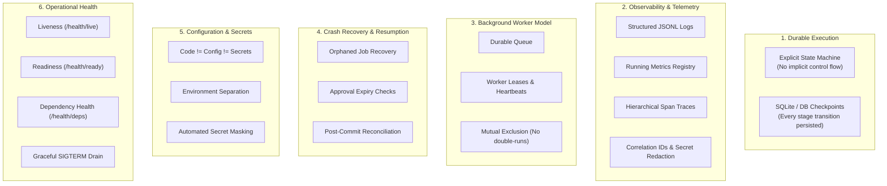
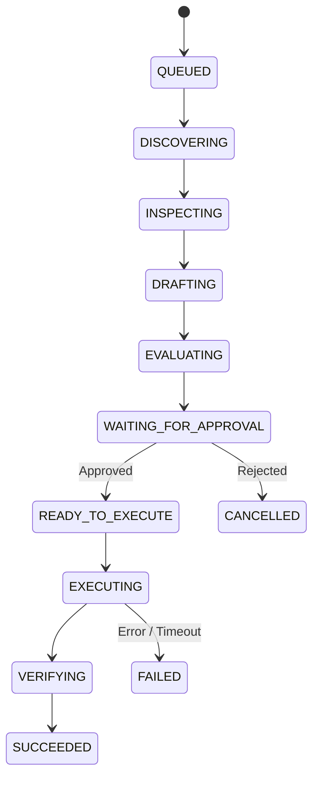
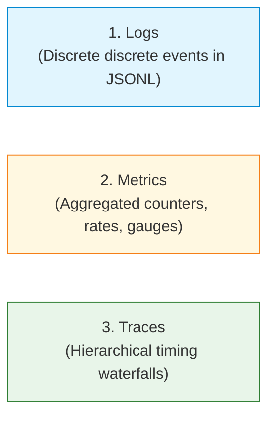

# Module 13: Production Agents — Concepts

The central principle of Production Agent Engineering is:

> **A production agent is not just an agent that works. It is an agent that can be observed, resumed, controlled, upgraded, and recovered while real work is happening.**
> 
> *Core Axiom: Production readiness is not "can the agent run?" It is "can the system keep operating correctly when processes crash, dependencies fail, workers restart, and versions change?"*

In a prototype or tutorial, an agent runs as an ephemeral script in a single terminal process. If the network hiccups, the process crashes, or a human takes 20 minutes to review a draft, the in-memory variables evaporate, work is lost, and restarting causes duplicate actions or corrupted state.

In production, agents must operate as **durable, asynchronous distributed services**.

---

## 1. Six Core Production Concerns



---

## 2. Durable Execution & Explicit State Machines

In prototype agents, execution flow is implicit: nested `if` statements, recursion, or loops. If the machine loses power during step 4, the runtime has no idea what happened.

A production agent replaces implicit control flow with an **explicit, verifiable state machine**:



### Transition Invariants
Every transition is strictly validated against a legal transition table. For example:
- `QUEUED -> EXECUTING` is an **illegal transition** and immediately raises `InvalidStateTransitionError`.
- Transitions must be saved to durable storage before any external side effect is attempted.

### Persistent Job Record Schema
Every agent run persists the following metadata:
```python
job_id: str                      # Unique correlation ID (e.g. RUN-1042)
agent_version: str               # e.g. "0.13.0"
prompt_version: str              # e.g. "reddit-draft-v4"
tool_schema_version: str         # e.g. "tools-v2"
policy_version: str              # e.g. "safety-v2"
evaluator_version: str           # e.g. "eval-v3"
current_stage: JobStage          # e.g. WAITING_FOR_APPROVAL
status: JobStatus                # e.g. IN_PROGRESS
attempt_count: int               # Incremented on worker claim
created_at: float                # Epoch timestamp
updated_at: float                # Last stage transition timestamp
last_heartbeat: float            # Worker liveness proof
leased_by: str | None            # Worker UUID holding exclusive lease
lease_expires_at: float | None   # Expiration timestamp of lease
input_snapshot: dict             # Initial task parameters
trajectory: list[dict]           # Complete audit history of actions
pending_action: dict | None      # Staged payload awaiting execution
result: dict | None              # Final terminal output
```

If the host process crashes while waiting for human review (`WAITING_FOR_APPROVAL`), restarting does not rediscover posts or regenerate drafts. It resumes directly from `WAITING_FOR_APPROVAL`.

---

## 3. Background Workers & Leases

Production agents should not run in user-facing HTTP request threads. They operate as asynchronous background workers consuming from a durable queue:

```text
       Scheduler
           ↓
     Durable Queue (SQLite / Postgres)
           ↓
  ┌─────────────────┐
  │  Agent Worker   │  <--->  Lease Heartbeats (every 10s)
  └────────┬────────┘
           ↓
     Persistent State
           ↓
     Reddit / Tools
```

### Worker Leases and Mutual Exclusion
Two workers must never process the same job simultaneously.
1. **Atomic Claim**: Worker A claims `RUN-1042` by setting `leased_by = "worker-1"`, `lease_expires_at = now + 30s`.
2. **Heartbeat**: Worker A extends the lease every 10 seconds while working.
3. **Worker Crash**: If Worker A dies, heartbeats cease and the lease expires.
4. **Reclamation**: Worker B scans the queue, notices `lease_expires_at < now`, claims the job, and resumes from the last durable checkpoint.

---

## 4. Crash Recovery & Post-Commit Reconciliation

When a worker resumes an interrupted job, it must handle two distinct recovery scenarios.

### Scenario A: Clean Resumption from Checkpoint
- Worker crashed while in `READY_TO_EXECUTE` after human approval.
- Resuming worker checks if the HMAC approval token has expired.
- If unexpired: verifies remote post content has not drifted, and dispatches the write.
- If expired: safely reverts to `WAITING_FOR_APPROVAL` for refreshed authorization.

### Scenario B (Flagship): Post-Commit Crash Reconciliation
A classic distributed systems nightmare:
1. Agent calls `client.submit_comment(post_id, text)`.
2. Reddit receives the request, publishes the comment, and returns `200 OK`.
3. **Power cuts out immediately** before the agent writes the local success checkpoint!
4. Process restarts. The job record still says `current_stage = EXECUTING`.

```text
Without Reconciliation:
Restart -> Re-run submit_comment() -> DUPLICATE COMMENT POSTED!

With Post-Commit Reconciliation:
Restart -> Detect pending write in EXECUTING
        -> Query remote thread from Reddit (get_comments)
        -> Match comment by author "u/HeroAgentBot" and text hash
        -> Found! Action actually succeeded on server!
        -> Mark SUCCEEDED in local state and queue
        -> DO NOT POST AGAIN!
```

---

## 5. Observability: The Three Operational Pillars

Do not rely on ad-hoc `print()` statements for production monitoring.



### 1. Structured Logs (JSONL)
Every event is emitted as a single-line JSON string:
```json
{
  "timestamp": "2026-10-05T19:44:02Z",
  "level": "INFO",
  "run_id": "RUN-1042",
  "job_id": "RUN-1042",
  "trace_id": "trace_RUN-1042",
  "action_id": "act_88",
  "stage": "EVALUATING",
  "event": "draft_scored",
  "details": {"score": 8.6}
}
```

### 2. Operational Metrics
Aggregate system behavior tracked continuously:
- `agent_runs_total`: Total runs attempted
- `agent_runs_success_total`: Successful completions
- `agent_runs_failed_total`: Failed runs
- `comments_submitted_total`: Total comments posted
- `comments_blocked_total`: Actions rejected by safety
- `approval_rejection_rate`: Rejections divided by total decisions
- `mean_steps_per_run`: Efficiency gauge
- `tool_errors_total`: Transient and permanent tool errors
- `reconciliation_total`: Number of writes salvaged via reconciliation
- `total_duration_seconds`: Total runtime

### 3. Hierarchical Traces
Every run generates a structured trace waterfall displaying latency across subtasks:
```text
RUN-1042
 ├── discover_posts       42 ms
 ├── inspect_post         18 ms
 ├── read_comments        61 ms
 ├── draft_comment       420 ms
 ├── evaluate             83 ms
 ├── wait_for_approval    12 ms
 ├── submit_comment      122 ms
 └── verify_comment       47 ms
```

### Correlation IDs
Every log line, metric increment, and tool call carries:
$$\mathbf{Correlation\ Tuple} = (\text{run\_id}, \text{job\_id}, \text{trace\_id}, \text{action\_id})$$
This allows instant filtering during incident response: *"Show me every API call that belonged to the run that failed at 03:14 AM."*

---

## 6. Configuration, Secrets & Environment Separation

> **Rule: Code != Configuration != Secrets**

1. **Code**: Immutable application logic stored in version control.
2. **Configuration**: Environment parameters (`APP_ENV`, `MAX_STEPS`, `LOG_LEVEL`, `ALLOWED_SUBREDDITS`).
3. **Secrets**: Sensitive credentials (`REDDIT_CLIENT_SECRET`, `HMAC_SIGNING_SECRET`).

### Rules of Secret Hygiene:
- Never commit secrets to git repositories or README files.
- Fail fast at startup if `APP_ENV=production` and required credentials are missing.
- Pass all log payloads through an automated `redact_secrets()` filter before writing to disk or network sinks.

---

## 7. Operational Health Checks

Production platforms (Kubernetes, AWS ECS, systemd) require three distinct health endpoints:

| Endpoint | Probe Type | Meaning | Check Logic |
| :--- | :--- | :--- | :--- |
| `/health/live` | **Liveness** | Is the process alive and execution loop running? | Returns 200 if worker thread is responsive. |
| `/health/ready` | **Readiness** | Can this worker accept new work right now? | Verifies SQLite / DB connection is open and responsive. |
| `/health/deps` | **Dependency Health** | Are external dependencies accessible? | Pings Reddit API or fetches rules. |

---

## 8. Graceful Shutdown (SIGTERM Handling)

When autoscaling down or deploying a new container version, the operating system sends a `SIGTERM` signal.

```text
SIGTERM Received
   ↓
Stop claiming new work
   ↓
Finish active atomic step
   ↓
Persist durable checkpoint
   ↓
Release worker lease (so other workers can pick it up immediately)
   ↓
Flush logs and metrics
   ↓
Exit cleanly (code 0)
```

Abruptly terminating an agent during a write can cause ghost writes, orphan locks, or corrupted state.

---

## 9. Async: The Proper Perspective

A common misconception is that "asyncio equals production."

> **Async improves concurrency for I/O-bound workloads. It does NOT provide durability, correctness, retries, or exactly-once execution.**

In an agent system, asynchronous I/O is excellent for concurrent read actions (e.g. fetching 5 post bodies simultaneously). However, state transitions and side-effecting writes must still flow through strict serialized safety invariants, durable transaction locks, and deterministic reconciliation.

---

## 10. At-Least-Once Delivery & Practical Reliability

Distributed queues and background workers deliver **at-least-once execution**, not magical "exactly-once execution."

$$\mathbf{Safe\ Practical\ Execution} = \text{At-least-once delivery} + \text{Idempotency} + \text{Reconciliation} + \text{Durable state}$$

By combining:
- SQLite durable leases (ensures only one worker runs at a time),
- HMAC capability tokens (ensures authorization is single-use),
- Postcondition reconciliation (verifies remote state after crashes),
the system achieves **effectively exactly-once side effects** in an inherently uncertain distributed world.

---

## 11. Run Versioning & Attribution

Every job record permanently logs:
```text
agent_version       = 0.13.0
prompt_version      = reddit-draft-v4
tool_schema_version = tools-v2
policy_version      = safety-v2
evaluator_version   = eval-v3
```

When production metrics change (e.g. task success rate drops from 80% to 65%), version tagging allows you to pinpoint whether the regression was caused by a prompt update, a safety policy modification, or an external API failure.

---

## 12. Case Study: Production Incident INC-REDDIT-LATENCY-402

### The Symptom
The team notices overall agent success rate drops sharply:
$$86\% \longrightarrow 61\%$$

### The Knee-Jerk (Wrong) Reaction
The prompt engineer assumes the model has become "dumber" and begins frantically rewriting system prompts and few-shot examples.

### The Production Observability Approach
1. The on-call engineer checks the **Metrics Registry**:
   - `tool_errors_total` spiked by 350%.
   - `read_comments` timeout rate increased from 2% to 37%.
2. The engineer inspects **Traces** for failed runs:
   - Span `read_comments` latency jumped from 61 ms to 9,800 ms (HTTP 504 timeouts).
3. Root Cause: Reddit API data center experiencing upstream degradation.
4. Resolution: The team temporarily increases retry backoff and timeout limits in `AgentConfig`. The system prompts remain untouched.

> **Production Mindset: Not every agent failure is a model failure.**
