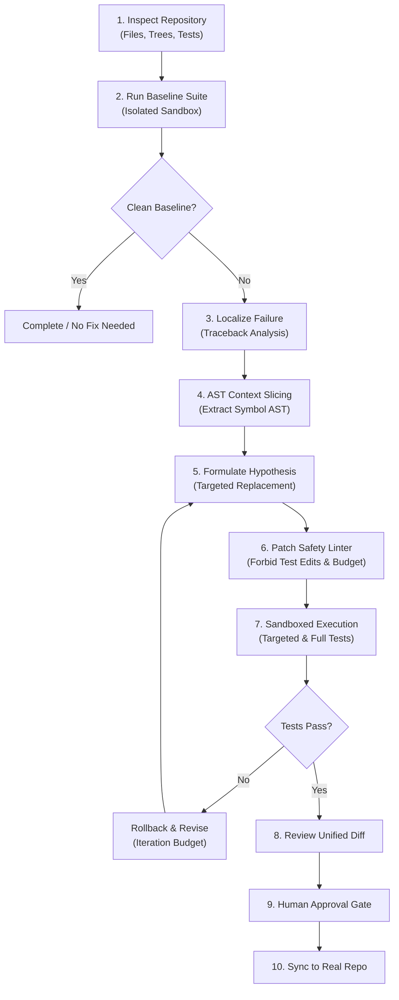

# Module 14: Coding Agents

**Difficulty Level:** Level 5 — Research  
**Status:** Ready  
**Prerequisites:** [01-agent-fundamentals](../01-agent-fundamentals/README.md), [08-agent-runtime-and-harness](../08-agent-runtime-and-harness/README.md), [11-agent-evaluation](../11-agent-evaluation/README.md), [12-agent-safety-and-verification](../12-agent-safety-and-verification/README.md), [13-production-agents](../13-production-agents/README.md)

---

## The Core Philosophy

> **A coding agent is an agent whose environment is a software repository, whose actions modify code, and whose verifier is the test and build system.**
>
> *Core Axiom: Generic chat assistants produce unverified text in a vacuum. A true coding agent operates directly within a repository: discovering files, slicing syntax trees, proposing minimal unified patches, running isolated tests in sandboxes, and verifying zero regressions before seeking human approval.*

---

## Learning Progression

```text
01–03  How agents perceive and act
04     How to build and test one
05     How agents remember
06     How agents plan
07     How agents manage context
08     How runtime controls execution
09     How multiple agents coordinate
10     How agents survive failure
11     How we measure whether they work
12     How we constrain and verify what they are allowed to do
13     How we operate them reliably in production
14     How an agent navigates, mutates, and verifies real codebases
```

---

## The Coding Agent Loop



---

## Subsystems in `examples/coding_assistant`

All components are implemented in **100% standard library Python 3.11+** with zero external dependencies:

| Subsystem | File | Purpose |
| :--- | :--- | :--- |
| **Repository Discovery** | [`repo.py`](../examples/coding_assistant/repo.py) | Directory traversal, language detection, ASCII tree generation, line slicing. |
| **Code Search & Grep** | [`search.py`](../examples/coding_assistant/search.py) | Fast regex search, pattern matching, symbol definition lookup. |
| **AST Navigation** | [`ast_tools.py`](../examples/coding_assistant/ast_tools.py) | Python AST parsing, symbol extraction, targeted function source slicing. |
| **Patch Engine** | [`patch.py`](../examples/coding_assistant/patch.py) | Unified diff creation, targeted string replacement, syntax validation. |
| **Execution Sandbox** | [`sandbox.py`](../examples/coding_assistant/sandbox.py) | Isolated tempdir cloning, sandboxed command execution, diff tracking, repo syncing. |
| **Verification & Linter** | [`verifier.py`](../examples/coding_assistant/verifier.py) | Unittest discovery and execution, traceback parser, patch safety linter. |
| **Agent Core & Scorecard**| [`agent.py`](../examples/coding_assistant/agent.py) | Master repair loop, hypothesis formation, regression testing, scorecard generation. |

---

## Safety & Invariant Guarantees

Autonomous code generation poses serious risks of test evasion and scope explosion. Module 14 enforces four strict invariants:

1. **Test Immutability Invariant**: Modifying files inside `tests/` or matching `test_*.py` is strictly rejected by `PatchSafetyLinter`. The agent must fix implementation bugs, not rewrite test assertions to pass deceptively.
2. **Diff Budget Invariant**: Patches exceeding the line delta budget (default: 50 lines) are blocked to prevent unbounded refactoring.
3. **Syntactic Validity Invariant**: Candidate Python modifications are validated via `ast.parse()` prior to disk execution, catching syntax errors before running test suites.
4. **Isolated Sandboxing**: Modifications and command executions occur inside detached temporary directories. The user's working tree is untouched until explicit human approval is granted.

---

## Quickstart & Demos

### 1. Run the Component Walkthrough
Inspects the repo, searches symbols, extracts AST function slices, validates safety linter invariants, and resolves bugs in a temporary sandbox:
```bash
python3 14-coding-agents/example.py
```

### 2. Run the Full Autonomous Coding Agent Demo
Executes the complete repair session on the deliberate bugs in `demo_repo/`:
```bash
python3 -m examples.coding_assistant.main
```

### 3. Review the Concepts & Exercises
- [Concepts Guide](concepts.md): Deep dive into repository environments, AST slicing, and sandbox design.
- [Hands-on Exercise](exercise.md): Extend the agent with AST call-graph extraction, forbidden-pattern security rules, and modulo repair.

---

## The Verifiable Scorecard

Every repair session outputs a structured telemetry scorecard:

```text
============================================================
CODING AGENT SCORECARD: RESOLVED
============================================================
Initial Failures:         2
Final Failures:           0
Target Tests Passed:      True
Regressions Clean:        True
Files Modified:           calculator.py, parser.py
Lines Added / Removed:    +3 / -2
Iterations Consumed:      2
Syntax Errors Caught:     0
Safety Violations Blocked:0
Human Approval Granted:   True
============================================================
```
