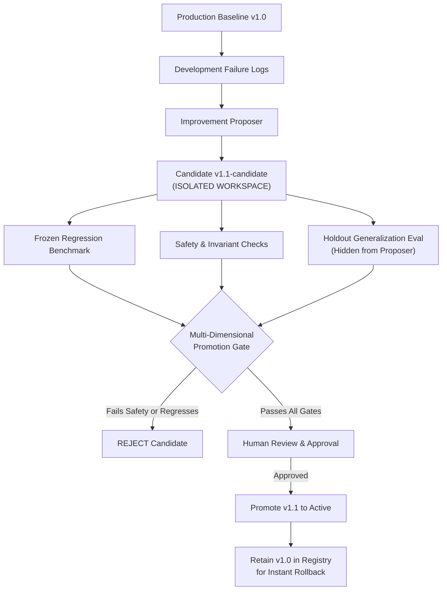

# Module 15: Self-Improving Agents

**Difficulty Level:** Level 5 — Research  
**Status:** Ready  
**Prerequisites:** [01-agent-fundamentals](../01-agent-fundamentals/README.md), [08-agent-runtime-and-harness](../08-agent-runtime-and-harness/README.md), [11-agent-evaluation](../11-agent-evaluation/README.md), [12-agent-safety-and-verification](../12-agent-safety-and-verification/README.md), [13-production-agents](../13-production-agents/README.md), [14-coding-agents](../14-coding-agents/README.md)

---

## The Core Philosophy

> **What changes when an agent is allowed to modify not just its task environment, but parts of the system that determine its own future behavior?**
>
> *Core Axiom: Unconstrained agents that rewrite their own codebase in place inevitably degrade, overfit, or bypass safety guardrails. Genuine self-improvement requires controlled, evidence-based evolution: isolated candidate workspaces, multi-dimensional frozen benchmarks, holdout generalization, strict verifier boundaries, and mandatory human promotion gates.*

---

## Learning Progression

```text
01–03  Give an agent perception and action
04     Build and test it
05     Give it memory
06     Give it planning
07     Control its context
08     Control its runtime
09     Coordinate multiple agents
10     Survive failure
11     Measure behavior
12     Constrain and verify behavior
13     Operate reliably in production
14     Modify software safely
15     Modify its own future behavior under evaluation and governance
```

---

## The Five Adaptation Surfaces

Self-improvement is not a single binary capability. Different adaptation surfaces have vastly different blast radii and risk profiles:

```text
Learning from experience
          |
Change retrieved examples / memory
          |
      LOW RISK (Level 1)
          |
          v
Prompt adaptation
          |
Change instructions & constraints
          |
    MODERATE RISK (Level 2)
          |
          v
Tool adaptation
          |
Change tool schemas & descriptions
          |
    HIGHER RISK (Level 3)
          |
          v
Workflow / harness adaptation
          |
Change control logic & policies
          |
    HIGHER RISK (Level 4)
          |
          v
Code modification
          |
Change executable source code
          |
    HIGHEST RISK (Level 5)
```

---

## The Controlled Self-Improvement Architecture



---

## Subsystems in `examples/self_improving_agent`

All components are implemented in **100% standard library Python 3.11+** with zero external dependencies:

| Subsystem | File | Purpose |
| :--- | :--- | :--- |
| **Version Registry** | [`versions.py`](../examples/self_improving_agent/versions.py) | Immutable version lineages, active production pointers, and audit trails. |
| **Adaptation Surfaces** | [`mutation.py`](../examples/self_improving_agent/mutation.py) | Defines the 5 surfaces, risk hierarchy, and protected verifier boundaries. |
| **Improvement Proposer** | [`proposer.py`](../examples/self_improving_agent/proposer.py) | Analyzes development failures while enforcing the holdout isolation boundary. |
| **Candidate Workspace** | [`candidate.py`](../examples/self_improving_agent/candidate.py) | Clones isolated workspaces and enforces protected-file safety invariants. |
| **Agent Implementations**| [`baseline.py`](../examples/self_improving_agent/baseline.py) | Baseline naive agent, candidate AST-localized agent, and unsafe negative control. |
| **Frozen Evaluator** | [`evaluator.py`](../examples/self_improving_agent/evaluator.py) | Runs frozen regression and holdout benchmarks; computes multi-dimensional metrics. |
| **Promotion Gate** | [`promotion.py`](../examples/self_improving_agent/promotion.py) | Multi-dimensional gate (zero tolerance on unsafe actions) and human approval. |
| **Rollback Manager** | [`rollback.py`](../examples/self_improving_agent/rollback.py) | Instant, verified production rollback to stable ancestor versions. |
| **Flagship Demo** | [`main.py`](../examples/self_improving_agent/main.py) | Full end-to-end runnable demonstration. |

---

## Safety & Governance Invariants

1. **The Prime Directive**: *The subject of evaluation must not control the evaluator.* Candidate agents are strictly forbidden from modifying test files, evaluation datasets, scoring harnesses, or promotion gates.
2. **Multi-Dimensional Promotion**: A single aggregate score is not enough. A candidate that boosts task success from 82% to 89% but increases unsafe actions from 0% to 2% is strictly **REJECTED**.
3. **Holdout Isolation**: The improvement proposer sees only development failures. Holdout benchmark datasets are strictly quarantined to prevent the agent from overfitting its own test suite.
4. **Mandatory Human Approval**: No candidate can be promoted to active production status without explicit human authorization.
5. **Rollback Guarantee**: Previous stable releases are permanently retained in the version registry. If production degradation occurs, the system rolls back instantly with an immutable audit log.

---

## Quickstart & Demos

### 1. Run the Component Walkthrough
Explores the 5 surfaces, verifies holdout boundary isolation, and evaluates baseline vs candidate:
```bash
python3 15-self-improving-agents/example.py
```

### 2. Run the Full Flagship Demo
Executes the entire self-improvement lifecycle, including rejection of an unsafe candidate, human promotion of v1.1, and canary rollback to v1.0:
```bash
python3 -m examples.self_improving_agent.main
```

### 3. Review the Concepts & Exercises
- [Concepts Guide](concepts.md): Deep dive into adaptation surfaces, evaluator isolation, multi-dimensional gates, and holdout evaluation.
- [Hands-on Exercise](exercise.md): Implement eval dataset tamper-proofing, AST evaluator isolation scanner, and canary rollback.

---

## The Culmination of Zero to Hero

```text
======================================================================
A system should earn the right to change itself through evidence, not confidence.
======================================================================
```
