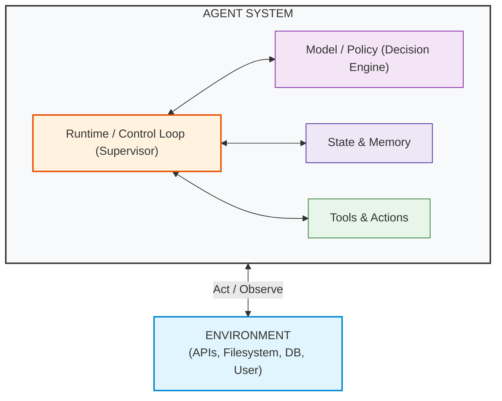
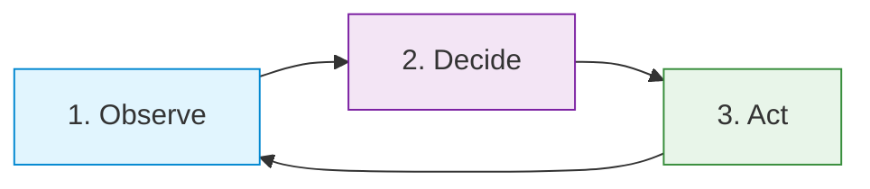

```mermaid
flowchart TD
    subgraph L1["Level 1 — Beginner"]
        M00["00-introduction<br/>(Prerequisites & Setup)"]
        M01["01-what-is-an-agent<br/>(Operational Taxonomy)"]
        M02["02-agent-loop<br/>(Observe-Decide-Act Mechanics)"]
        M00 --> M01 --> M02
    end

    subgraph L2["Level 2 — Builder"]
        M03["03-tools-and-function-calling<br/>(Tool Schemas & MCP)"]
        M04["04-build-your-first-agent<br/>(The Complete End-to-End Agent)"]
        M05["05-state-and-memory<br/>(State, History & Memory Stores)"]
        M02 --> M03 --> M04 --> M05
    end

    subgraph L3["Level 3 — Systems"]
        M06["06-planning-and-reasoning<br/>(ReAct & Task Decomposition)"]
        M07["07-context-engineering<br/>(Window Budgets & Pollution)"]
        M08["08-agent-runtime-and-harness<br/>(Middleware, Budgets & Limits)"]
        M09["09-multi-agent-systems<br/>(Handoffs & Supervisor Patterns)"]
        M05 --> M06 --> M07 --> M08 --> M09
    end

    subgraph L4["Level 4 — Production"]
        M10["10-agent-failures<br/>(Taxonomy & Defense Patterns)"]
        M11["11-agent-evaluation<br/>(Trajectory Evals & Benchmarks)"]
        M12["12-agent-safety-and-verification<br/>(Sandboxing & Approvals)"]
        M13["13-production-agents<br/>(Observability & Persistence)"]
        M09 --> M10 --> M11 --> M12 --> M13
    end

    subgraph L5["Level 5 — Research"]
        M14["14-coding-agents<br/>(Repo Search, Patching & Evals)"]
        M15["15-self-improving-agents<br/>(Meta-Learning & Evolution)"]
        M13 --> M14 --> M15
    end

    style L1 fill:#e8f5e9,stroke:#2e7d32
    style L2 fill:#e1f5fe,stroke:#0288d1
    style L3 fill:#fff8e1,stroke:#f57f17
    style L4 fill:#fbe9e7,stroke:#d84315
    style L5 fill:#f3e5f5,stroke:#6a1b9a
```

# AI Agents: Zero → Hero

Everyone is talking about AI agents.

But what actually makes something an agent?

Is ChatGPT an agent? 
Is a deterministic workflow an agent? 
What happens between an LLM deciding to call a tool and that tool actually executing? 
Where does memory live? 
Who controls the loop? 
Who decides when the agent stops? 
And what happens when an agent makes the wrong change?

This repository answers those questions from **first principles**.

No magic. 
No framework-first abstractions. 


---

> **What about AI agents confuses you?**
>
> Have a question or a concept you want demystified? Check out [QUESTIONS.md](QUESTIONS.md) or [submit a question via GitHub Issues](../../issues/new?template=question.md). Questions from the community directly shape upcoming modules in this series!

---

## Where Should You Start?

- **New to agents?** Start here → **[01 — What Is an Agent?](01-what-is-an-agent/README.md)**
- **Want to build one from scratch?**
  - **[02 — The Agent Loop](02-agent-loop/README.md)**
  - **[03 — Tools & Function Calling](03-tools-and-function-calling/README.md)**
  - **[04 — Build Your First Agent](04-build-your-first-agent/README.md)**
- **Want to understand what frameworks hide?**
  - **[08 — Agent Runtime & Harness](08-agent-runtime-and-harness/README.md)**

---

## 5-Minute Zero-Dependency Quick Start

Clone and run the complete agent loop immediately with Python 3.11+:

```bash
git clone https://github.com/tradertanmay/ai-agents-zero-to-hero.git
cd ai-agents-zero-to-hero

# 1. Compare Chatbot vs Workflow vs Agent
python3 01-what-is-an-agent/example.py

# 2. Run the pure Python Observe-Decide-Act loop
python3 02-agent-loop/example.py

# 3. Run your first complete multi-step agent
python3 04-build-your-first-agent/example.py
```

> **No API key. No framework. No dependencies. Just Python.**

---

## What This Repository Is

A practical, progressive, code-first curriculum designed to take you from:

> *"I understand LLMs and APIs, but I don't really understand what people mean by an AI agent."*

to:

> *"I understand how agents work internally and can build, debug, evaluate, and reason about production agent systems."*

---

## Who This Is For

This repository is built for **everyone who wants to understand and build AI agents** — whether you are a software engineer, technical lead, researcher, product builder, student, or curious developer.

It is especially designed for you if you:
- Want to move beyond prompt engineering and understand how autonomous agent systems actually work
- Know basic Python (or can follow readable standard code)
- Have used ChatGPT or called LLM APIs, but want to see the underlying machinery behind tools, memory, and loops
- Hear industry buzzwords like *ReAct, Function Calling, Memory, Agent Harness, Multi-Agent, MCP* and want a crystal-clear, framework-independent mental model

---

## Core Philosophy: The Model is Not the Agent

A common beginner assumption is:

$$\text{Agent} \stackrel{?}{=} \text{LLM} + \text{Prompt}$$

In reality, a base LLM inference call does not itself maintain persistent application state across turns. An **Agent System** is a composite computational system comprising a model policy, an execution control loop, state management, and tools, which observes and acts upon an external **Environment**.

$$\mathbf{Agent\ System = Model/Policy + Runtime/Control\ Loop + State + Tools}$$



### The Core Agent Loop

At the heart of every agent is the cyclic feedback loop with its environment:



1. **Observe**: Read the current state of the world, conversation history, and tool feedback.
2. **Decide**: The model reasons over the observation and chooses an action or final response.
3. **Act**: An execution layer performs the action on the environment.
4. **Observe Again**: The environment output becomes a new observation fed back to the model.

> **Key Rule**: The model chooses or requests an action; an **execution layer** performs it. In a from-scratch agent like the one in this course, that execution layer is our Python runtime. In hosted platforms, the provider may execute certain hosted tools on the application’s behalf.

---

## What People Call an "Agent" — Operational Spectrum

There is no universally agreed boundary across industry and research for what counts as an "agent." In this course, we use the following operational spectrum to make the architectural differences explicit:

```mermaid
flowchart LR
    LLM["1. Raw LLM"] --> Chat["2. Chatbot"]
    Chat --> RAG["3. RAG Pipeline"]
    RAG --> Work["4. Workflow"]
    Work --> ToolLLM["5. Tool-Using LLM"]
    ToolLLM --> Agent["6. Iterative Autonomous Agent"]
    Agent --> Multi["7. Multi-Agent System"]

    style LLM fill:#f5f5f5,stroke:#9e9e9e
    style Chat fill:#e1f5fe,stroke:#0288d1
    style RAG fill:#e0f7fa,stroke:#0097a7
    style Work fill:#fff8e1,stroke:#f57f17
    style ToolLLM fill:#f3e5f5,stroke:#7b1fa2
    style Agent fill:#e8f5e9,stroke:#2e7d32,stroke-width:2px
    style Multi fill:#ede7f6,stroke:#4527a0
```



| Stage | Paradigm | How Decisions Are Made | Can it take actions? | Closed Feedback Loop? | Agentic characteristics |
| :--- | :--- | :--- | :--- | :--- | :--- |
| **1** | **Raw LLM** | Predicts next tokens based on prompt | No | No | **None** |
| **2** | **Chatbot** | Appends user/assistant turns to history | No | Only via user | **Low** |
| **3** | **RAG Pipeline** | Hardcoded retrieval $\to$ LLM synthesis | No | No | **Low** |
| **4** | **Workflow / Chain** | Fixed code sequence ($A \to B \to C$) | Fixed actions | Fixed error handling | **Predetermined control** |
| **5** | **Tool-Using LLM** | Model selects 1 tool $\to$ returns answer | Yes 1-shot action | No iterative retry | **Some** |
| **6** | **Iterative Autonomous Agent** | Dynamic Observe $\to$ Decide $\to$ Act loop | Yes Dynamic actions | Yes Closed runtime feedback | **High** |
| **7** | **Multi-Agent System** | Multiple agents with handoffs & roles | Yes Distributed actions| Yes Inter-agent feedback | **Multiple interacting agents** |

---

## Conceptual Clarity: Stop Mixing These Up

### The 5 Context & Data Concepts
| Term | What It Actually Is | Lifespan |
| :--- | :--- | :--- |
| **Prompt** | The static text template or instruction formatted for a single inference call. | Single API call |
| **Context** | The exact collection of tokens passed into the model's attention window at time $t$. | Single API call |
| **History** | The ordered sequence of prior user/assistant turns and tool observations. | Conversation |
| **State** | The full operational data structure (variables, step count, budget, artifacts, scratchpad). | Task execution |
| **Memory** | Knowledge persisted across tasks/sessions (vector indices, key-value stores, user profiles). | Persistent / Multi-session |

### The 5 System Components
| Component | Primary Responsibility | Example |
| :--- | :--- | :--- |
| **Model** | Probabilistic decision-maker and text generator. | GPT-4o, Claude 3.5 Sonnet, Gemini 2.0 |
| **Tool** | A callable capability that inspects or mutates the environment. | `calculator()`, `read_file()`, `sql_query()` |
| **Environment** | The external world the agent observes and acts upon. | Filesystem, REST API, Database, Shell |
| **Runtime / Harness** | The supervisor controlling loops, step limits, permissions, and tool execution. | Python loop, LangGraph runtime |
| **Agent System** | The complete composite system (Model + Runtime + Tools + State). | Minimal Agent, Coding Assistant |

---

## Visual Curriculum Map

Every module is labeled with a difficulty level so you can track your progression:

```text
Level 1: Beginner → Level 2: Builder → Level 3: Systems → Level 4: Production → Level 5: Research
```



---

## Curriculum Table of Contents (Numerical Progression)

| Module | Level | Status | What You Will Learn |
| :--- | :--- | :--- | :--- |
| **[00-introduction](00-introduction/README.md)** | Level 1 | Ready | Course architecture, prerequisites, mental models |
| **[01-what-is-an-agent](01-what-is-an-agent/README.md)** | Level 1 | Ready | LLM vs Chatbot vs Workflow vs Agent; operational taxonomy |
| **[02-agent-loop](02-agent-loop/README.md)** | Level 1 | Ready | The cyclic Observe-Decide-Act execution loop |
| **[03-tools-and-function-calling](03-tools-and-function-calling/README.md)** | Level 2 | Ready | Tool lifecycle, schemas, validation & **MCP Deep Dive** |
| **[04-build-your-first-agent](04-build-your-first-agent/README.md)** | Level 2 | Ready | Assembling the first complete agent + 10-case regression scorecard |
| **[05-state-and-memory](05-state-and-memory/README.md)** | Level 2 | Coming Soon | Context vs State vs History vs Vector Memory |
| **[06-planning-and-reasoning](06-planning-and-reasoning/README.md)** | Level 3 | Coming Soon | ReAct, decomposition, reflection, and limits of reasoning |
| **[07-context-engineering](07-context-engineering/README.md)** | Level 3 | Coming Soon | Context budgets, compression, and anti-pollution |
| **[08-agent-runtime-and-harness](08-agent-runtime-and-harness/README.md)** | Level 3 | Ready | Harness as the OS: step limits, budgets, middleware & aborts |
| **[09-multi-agent-systems](09-multi-agent-systems/README.md)** | Level 3 | Coming Soon | Supervisor-worker, handoffs, and when NOT to use multi-agent |
| **[10-agent-failures](10-agent-failures/README.md)** | Level 4 | Coming Soon | Failure taxonomy, loops, hallucinated tools & mitigations |
| **[11-agent-evaluation](11-agent-evaluation/README.md)** | Level 4 | Coming Soon | Advanced trajectory evaluation, LLM-as-judge & benchmarks |
| **[12-agent-safety-and-verification](12-agent-safety-and-verification/README.md)** | Level 4 | Coming Soon | Permission gates, sandboxing, and deterministic verification |
| **[13-production-agents](13-production-agents/README.md)** | Level 4 | Coming Soon | Tracing, telemetry, distributed state, and rate limits |
| **[14-coding-agents](14-coding-agents/README.md)** | Level 5 | Coming Soon | Repo navigation, patch generation, and test loops |
| **[15-self-improving-agents](15-self-improving-agents/README.md)** | Level 5 | Coming Soon | Dynamic few-shot adaptation, trajectory reflection & safety |

---

## Zero Dependencies & Framework Independence

We believe you should understand how agents work even if every agent framework disappeared tomorrow.

- **Zero Mandatory Third-Party Packages**: Everything runs on standard Python 3.11+.
- **Zero Required API Keys**: All core lessons include deterministic simulators and mock LLMs for 100% offline learning and automated testing.
- **Pluggable Real Providers**: Want to use a real model? Drop in your API key for OpenAI, Anthropic, Gemini, or local Ollama instances in `examples/minimal_agent/`.

### How this maps to popular frameworks & protocols (Optional Perspective)
Once you master the mechanics in this repo, you will understand how modern tools and frameworks organize these responsibilities:

- **LangGraph** — maps many of these concepts into a graph-oriented orchestration/runtime model with explicit state, nodes, durable execution, and human-in-the-loop control.
- **AutoGen** — provides abstractions for agents, teams, messaging, and event-driven multi-agent orchestration.
- **OpenAI Agents SDK** — provides an agent runtime with a built-in agent loop, function tools, handoffs, guardrails, sessions, and tracing.
- **MCP (Model Context Protocol)** — an open protocol for connecting AI applications to external capabilities and context providers. MCP servers can expose tools, resources, and prompts through a standardized protocol.

---

## Repository Structure (Strict Numerical Order)

```text
ai-agents-zero-to-hero/
├── README.md # Main course landing page
├── LICENSE # MIT License
├── CONTRIBUTING.md # Contribution & pedagogical standard
├── ROADMAP.md # Curriculum milestone checklist
├── QUESTIONS.md # Community Q&A hub
├── pyproject.toml # Standard Python packaging config
├── .github/ # Issue templates
│
├── 00-introduction/ # Module 0: Prerequisites & mental models
├── 01-what-is-an-agent/ # Module 1: Operational spectrum & agent architecture
├── 02-agent-loop/ # Module 2: The Observe-Decide-Act loop
├── 03-tools-and-function-calling/ # Module 3: Tool schemas, execution lifecycle & MCP
├── 04-build-your-first-agent/ # Module 4: Assembling your first complete agent
├── 05-state-and-memory/ # Module 5: [Coming Soon]
├── 06-planning-and-reasoning/ # Module 6: [Coming Soon]
├── 07-context-engineering/ # Module 7: [Coming Soon]
├── 08-agent-runtime-and-harness/ # Module 8: The Agent Harness / Operating System
├── 09-multi-agent-systems/ # Module 9: [Coming Soon]
├── 10-agent-failures/ # Module 10: [Coming Soon]
├── 11-agent-evaluation/ # Module 11: [Coming Soon]
├── 12-agent-safety-and-verification/ # Module 12: [Coming Soon]
├── 13-production-agents/ # Module 13: [Coming Soon]
├── 14-coding-agents/ # Module 14: [Coming Soon]
├── 15-self-improving-agents/ # Module 15: [Coming Soon]
│
├── examples/
│ └── minimal_agent/ # Modular, runnable showcase agent
│ ├── README.md
│ ├── llm.py # Pluggable LLM interface (Mock, OpenAI, Anthropic, Gemini, Ollama)
│ ├── state.py # State representation & history
│ ├── tools.py # Tool definitions & registry
│ ├── runtime.py # Step controller & budget enforcement
│ ├── agent.py # Pure agent logic
│ └── main.py # Runnable demo script
└── tests/ # Unittest verification suite
    ├── test_module_01.py
    ├── test_module_02.py
    ├── test_module_03.py
    ├── test_module_04.py
    ├── test_module_08.py
    └── test_minimal_agent.py
```

---

## Running the Tests

Run the zero-dependency test suite using standard Python:

```bash
python3 -m unittest discover -s tests -v
```

---

## License

This educational repository is open-sourced under the [MIT License](LICENSE).
