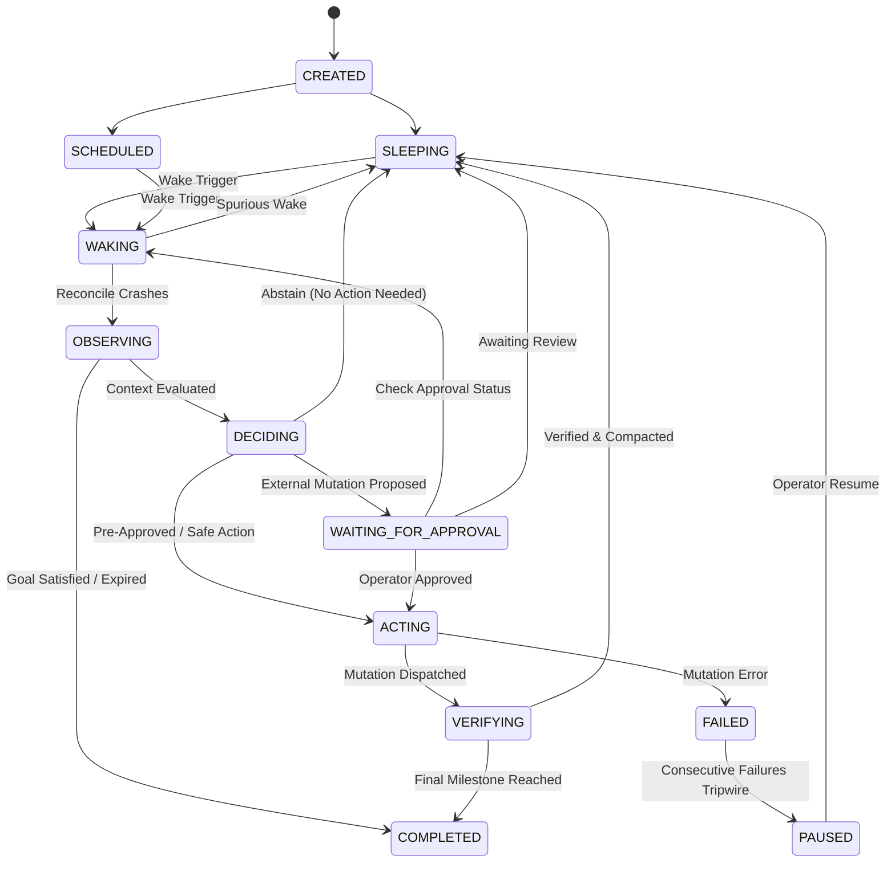

# A2 — Persistent Agent: Core Architectural Concepts

> "Persistence is not an infinite loop. A persistent agent is a system with durable goals, durable state, and controlled reactivation across time."

---

## 1. Introduction: The Persistence Illusion

A common beginner pattern when building "autonomous agents" is writing a while-true loop:

```python
# The Naive Anti-Pattern: The Infinite Busy-Wait Loop
while True:
    events = poll_environment()
    actions = llm_plan(events)
    execute(actions)
    time.sleep(60)
```

This pattern fails in production for fundamental engineering reasons:
1. **Process Volatility**: If the process crashes, the server reboots, or Kubernetes reschedules the pod, all in-flight state, working scratchpads, and intentions vanish.
2. **Context Window Explosion**: An agent running indefinitely in memory accumulates prompt tokens until it hits token limits, slows down, or hallucinates from context rot.
3. **Uncontrolled Resource Consumption**: An unconstrained loop burns API budget, exhausts rate limits, and performs unsolicited actions during quiet periods.
4. **Stale World Assumptions**: An in-memory loop assumes that nothing in the external world changed while it was sleeping, leading to race conditions and double-mutations.

Real-world persistence requires a completely different mental model.

---

## 2. Persistent Memory vs. Persistent Agent

Learners must understand the critical architectural distinction between persistent memory and a persistent agent:

| Dimension | Persistent Memory | Persistent Agent |
| :--- | :--- | :--- |
| **Primary Scope** | Information survives across sessions | Goals, state, unfinished work, and execution survive across sessions |
| **Typical Mechanism** | Vector store, SQL database, key-value cache | Durable state machine, SQLite checkpointing, task leases, audit trail |
| **Reactivation** | Passive; retrieved only when an agent queries it | Active; triggered deterministically by timer, event, or operator |
| **Unfinished Work** | Must be re-discovered or re-prompted | Tracked as active durable commitments with crash reconciliation |
| **Process Restart** | Stores past conversations | Resumes interrupted workflows without duplicate external side-effects |

A system with persistent memory merely *remembers*. A persistent agent *resumes*.

---

## 3. The 12-State Persistent Lifecycle

A robust persistent agent is modeled as an explicit state machine. Each state transition is validated against a transition table and recorded to an immutable audit trail before execution proceeds.



### Lifecycle States Defined

1. **CREATED**: Instantiated with an assigned durable goal, but not yet active.
2. **SCHEDULED**: Registered with a timer or cron trigger for its next planned cycle.
3. **SLEEPING**: Completely inactive in memory. All state is safely persisted in durable storage. Zero CPU and zero API cost.
4. **WAKING**: Reactivated by an event or schedule. Checks for unresolved actions from previous crashes before proceeding.
5. **OBSERVING**: Queries external environment (e.g., GitHub issues, pull requests, CI status) and revalidates its durable goal.
6. **DECIDING**: Evaluates observations against goals and commitments. Can choose to act, request approval, or abstain.
7. **WAITING_FOR_APPROVAL**: Pauses execution while a human reviews a proposed mutation token.
8. **ACTING**: Executes approved mutation using an idempotency key to prevent double execution.
9. **VERIFYING**: Confirms external state matches expected mutation outcome and updates commitment status.
10. **COMPLETED**: Terminal state reached when durable goal criteria are fulfilled or expiration timestamp passes.
11. **PAUSED**: Protective circuit-breaker triggered when autonomy budget is exhausted or repeated errors occur.
12. **FAILED**: Action execution failed within retry limits.

---

## 4. Durable Goals vs. Ephemeral Tasks

In single-turn agents, an objective is an ephemeral prompt string (e.g., `"Summarize this file"`). In persistent agents, goals are long-lived entities:

```python
@dataclass
class DurableGoal:
    goal_id: str
    description: str
    target_repo: str
    is_active: bool
    created_at: str
    expires_at: str | None
    success_criteria: list[str]
    completion_notes: str | None
```

### Goal Revalidation
On every wake cycle, before planning actions, the agent must **revalidate** its durable goal against live reality:
- Has the goal duration expired?
- Has the repository been archived or deleted?
- Have the success criteria already been met by external team members?

If reality invalidates the goal, the agent must cleanly terminate into `COMPLETED` or `CANCELLED` rather than generating pointless busywork.

---

## 5. Controlled Reactivation: Scheduled vs. Event-Driven Wakes

A persistent agent does not poll in a tight loop. Reactivation occurs via two controlled paths:

1. **Scheduled Reactivation**:
   - Time-based triggers (e.g., hourly repository sweep, daily stale issue check).
   - Uses exponential backoff with jitter when consecutive errors occur.
   - Computes `next_wake_at` and sleeps until that timestamp.

2. **Event-Driven Reactivation**:
   - Webhook triggers (e.g., `github.issues.opened`, `github.pull_request.ready_for_review`).
   - Delivered via an asynchronous event bus or queue.
   - Wakes the agent immediately to handle the specific entity.

---

## 6. Crash Recovery & Idempotency Reconciliation

Process crashes are inevitable. A persistent agent must survive crashes at any phase—especially between deciding to act and recording verification.

### The Mid-Action Crash Problem
Suppose an agent decides to post a triage comment on Issue #42:
1. Agent generates idempotency key: `steward-001:triage:issue:42`.
2. Agent sends HTTP POST to GitHub.
3. GitHub processes the comment and stores it.
4. The agent host machine loses power before receiving the HTTP 200 response or saving the checkpoint!

### The Reconciliation Protocol
When the agent starts up and transitions to `WAKING`:
1. It inspects `pending_action` in SQLite.
2. If `pending_action` exists, it does NOT blindly retry.
3. It inspects remote reality using the stored `idempotency_key` or queries the issue comment log.
4. If the comment already landed, it records `CRASH_RECONCILED`, marks the commitment as fulfilled, clears `pending_action`, and proceeds safely without double-posting.

---

## 7. The Power of Abstention

The hallmark of a mature persistent agent is the ability to do nothing.

In naive architectures, an agent prompted with "Maintain this repo" feels compelled to output an action on every invocation. It invents unnecessary labels, posts repetitive comments, and annoys human maintainers.

In a persistent architecture, **ABSTAIN** is an explicit, first-class decision:
- If all open issues are triaged, **ABSTAIN**.
- If pull requests are awaiting contributor updates, **ABSTAIN**.
- If CI checks are running normally, **ABSTAIN**.

The agent logs the abstention reason to the audit trail and returns to `SLEEPING`.

---

## 8. Human-in-the-Loop Approval & Stale-Action Protection

Autonomous write operations on public repositories require governance.

1. **Approval Tokens**: Dangerous mutations (commenting, closing issues, merging PRs) generate an `ApprovalRequest` with a cryptographically unique token and a time-to-live (TTL).
2. **Stale-Action Protection**: At the time of proposal, the agent computes a cryptographic hash of the entity's state (e.g., SHA256 of issue title, state, and comment count). When the human approves the token 12 hours later, the agent verifies the live hash against the proposal hash. If a maintainer already resolved the issue manually, the approval token is rejected as **stale**, preventing conflicting actions.

---

## 9. Memory Tiering & Compaction

To run for months without exceeding LLM context windows or degrading decision quality, the persistent agent employs tiered memory:

```
+-------------------------------------------------------------+
|                     Working State                           |
|       (Ephemeral scratchpad for current wake cycle)         |
+-------------------------------------------------------------+
                              |
                              v
+-------------------------------------------------------------+
|                     Recent Events                           |
|        (FIFO buffer of last N observation/action logs)       |
+-------------------------------------------------------------+
                              | Compaction (when len > N)
                              v
+-------------------------------------------------------------+
|                  Long-Term Rolling Summary                  |
|     (Consolidated synopsis of past weeks and milestones)    |
+-------------------------------------------------------------+
                              +
+-------------------------------------------------------------+
|                    Important Facts                          |
|         (Key-value store of durable repository norms)       |
+-------------------------------------------------------------+
```

When recent events exceed a configured limit (e.g., 5 cycles), the compaction engine rolls older events into a high-density chronological narrative, archives fulfilled commitments, and clears the FIFO buffer.

---

## 10. Concluding Axiom

> **"A persistent agent is not an agent that runs forever. It is an agent that can stop, remember, wake up, re-observe reality, and safely continue pursuing a durable goal."**
