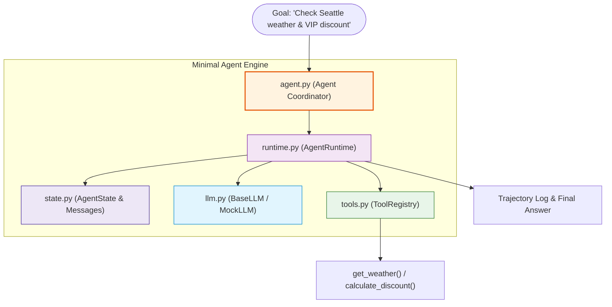

# Minimal Agent Showcase

A clean, modular, and fully functional AI agent built with **zero external dependencies** in standard Python 3.11+.

---

## Architecture Overview



---

## File Responsibilities

| File | Purpose | Lines of Code |
| :--- | :--- | :--- |
| **`state.py`** | `Message` and `AgentState` dataclasses representing execution state. | ~30 |
| **`tools.py`** | Automatic JSON schema generator and `ToolRegistry` executor. | ~75 |
| **`llm.py`** | Provider-agnostic model interface (`MockLLM`, `OpenAIAdapter`, `AnthropicAdapter`, `GeminiAdapter`, `OllamaAdapter`). | ~130 |
| **`runtime.py`** | Step supervisor, budget limits, timeout guards, and trajectory recorder. | ~70 |
| **`agent.py`** | Clean high-level coordinator binding Model, Tools, and Runtime. | ~30 |
| **`main.py`** | Standalone runnable script demonstrating end-to-end task execution. | ~50 |

---

## Running the Example

### 1. Run Offline (Default / Zero Dependencies / No API Key)
```bash
python examples/minimal_agent/main.py
```

### 2. Plug in a Real LLM Provider (Optional)
Open `examples/minimal_agent/main.py` and replace `llm = MockLLM()` with your preferred provider:

```python
# OpenAI
llm = OpenAIAdapter(api_key="sk-...", model_name="gpt-4o-mini")

# Anthropic Claude
llm = AnthropicAdapter(api_key="sk-ant-...", model_name="claude-3-5-sonnet-20241022")

# Google Gemini
llm = GeminiAdapter(api_key="AIzaSy...", model_name="gemini-2.0-flash")

# Local Ollama (100% local, free, zero keys)
llm = OllamaAdapter(model_name="llama3")
```
