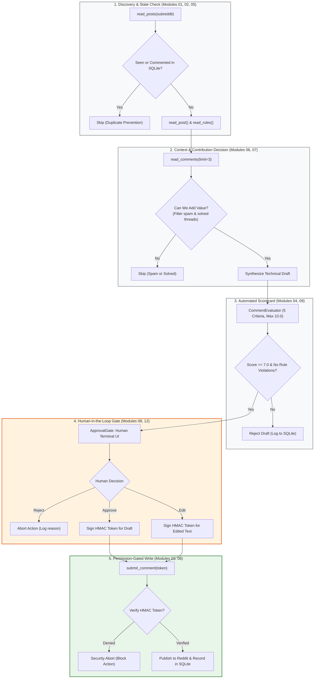

# Capstone Project: Reddit Comment Agent

A production-grade, **human-in-the-loop** AI agent demonstrating how **Modules 01 through 09** unite into a single real-world system.

Built with **zero external dependencies** in pure standard Python 3.11+. Runs 100% offline out-of-the-box with a deterministic simulated Reddit environment.

---

## Why This Capstone Matters

Before this capstone, each module taught an isolated subsystem:
- How to write a loop (Modules 01–02)
- How to define tools (Module 03)
- How to evaluate outputs (Module 04)
- How to persist state (Module 05)
- How to plan multi-step workflows (Module 06)
- How to budget and prune context (Module 07)
- How to supervise execution with a runtime harness (Module 08)
- How to coordinate specialized roles (Module 09)

The **Reddit Comment Agent** is the point where everything connects. You cannot build a safe, useful Reddit agent without every single one of these subsystems:

```
[Module 01-02] Observe -> Decide -> Act Loop
      |
[Module 03]    Reddit Tool Calling (read_posts, read_post, read_comments, submit_comment)
      |
[Module 05]    State & Memory (Check SQLite: Have we already seen or commented on this post?)
      |
[Module 06]    Planning: Find -> Inspect -> Decide whether to contribute -> Draft
      |
[Module 07]    Context Engineering (Inject subreddit rules; trim 50 noisy comments down to top 3)
      |
[Module 04/09] Automated Evaluator Scorecard (Relevance, Rules, Value-Add, Tone, Accuracy)
      |
[Module 08/12] MANDATORY HUMAN APPROVAL GATE (HMAC Token Verification)
      |
[Module 03/08] Permission-Gated Submission (submit_comment only executes with valid token)
```

---

## System Architecture



---

## The Mandatory Human Approval Gate

In educational and early production systems, **autonomous posting must never be the default**.

When the agent discovers an eligible post and drafts a response scoring $\ge 7.0/10.0$, execution pauses and renders an interactive verification card to the human operator:

```text
=================================================================
HUMAN-IN-THE-LOOP APPROVAL REQUIRED
=================================================================
SUBREDDIT: r/Python
POST TITLE: What is the cleanest standard library way to safely query nested dicts?
POST AUTHOR: u/python_builder
-----------------------------------------------------------------
POST CONTENT:
I frequently parse API payloads with shapes like data['user']['profile']['address']['zip'].
Sometimes an intermediate key is missing or set to None, raising KeyError or TypeError.
Writing 5 nested .get() calls gets ugly fast. Is there a clean, zero-dependency pattern in
Python 3.10+ standard library to handle this?
-----------------------------------------------------------------
PROPOSED DRAFT COMMENT (Evaluator Score: 10.0/10.0):
For deeply nested dictionary queries in standard Python 3.10+, you can use
`functools.reduce` with a safe lookup helper to avoid repeated chained `.get()` calls:

```python
from functools import reduce

def safe_get(dictionary: dict, *keys, default=None):
    try:
        return reduce(lambda d, k: d[k] if isinstance(d, dict) else default, keys, dictionary)
    except (KeyError, TypeError, IndexError):
        return default

# Usage example:
# val = safe_get(data, 'user', 'profile', 'address', 'zip')
```

This handles missing keys, `None` values along the path, and non-dict intermediate objects
with zero external dependencies while staying fully idiomatic.
-----------------------------------------------------------------
EVALUATOR BREAKDOWN:
Score: 10.0/10.0 | Verdict: APPROVED_FOR_REVIEW
  - relevance: 2.0/2.0 (Draft directly addresses core technical inquiry.)
  - rule_compliance: 2.0/2.0 (Complies with subreddit rules and guidelines.)
  - value_add: 2.0/2.0 (Provides novel, complementary technical insight.)
  - tone_and_clarity: 2.0/2.0 (Tone is respectful, constructive, and concise.)
  - accuracy_actionability: 2.0/2.0 (Contains concrete code pattern or actionable guidance.)
=================================================================
ACTIONS:
  [1] Approve & Post comment
  [2] Edit comment before posting
  [3] Reject and skip post
=================================================================
Select action (1/2/3) [default: 3]:
```

### Evaluator Approval != Permission to Act

A critical architectural distinction is established here:

```text
Evaluator (Quality Gate)
"Is this draft good enough to show a human?"
        ↓
Human Approval
"Do I authorize this exact action?"
        ↓
Runtime
"Is the authorization capability token valid and unconsumed?"
        ↓
submit_comment()
```

1. **Quality Gate, Not Proof of Accuracy**: The 5-criterion evaluator is an automated heuristic filter, not mathematical proof of factual correctness. A 10/10 score means the draft passed our baseline criteria and is worth human attention; it does not eliminate the need for human discernment or advanced evaluation (covered in Module 11).
2. **Cryptographically Enforced Approval Capability**: The write tool `submit_comment(post_id, comment_text, approval_token)` requires a signed, short-lived approval token that the agent cannot generate itself. This capability token is cryptographically bound to `post_id`, the SHA-256 hash of the exact approved comment text, an expiration timestamp, and a single-use nonce. If the model modifies the text, replays an old token, or attempts an unauthorized call, the action is rejected with `PermissionDeniedError`.

---

## File Responsibilities

| File | Module Connection | Purpose |
| :--- | :--- | :--- |
| **`mock_reddit.py`** | Offline Environment | In-memory simulator providing subreddits (`r/Python`, `r/MachineLearning`), realistic threads, rules, and comment trees. |
| **`reddit.py`** | Abstraction Layer | `RedditClient` abstract base class, `MockRedditClient` (default), and optional `PRAWRedditClient` for real credentials. |
| **`state.py`** | Module 05 (Memory) | Persistent SQLite database tracking `seen_posts`, `commented_posts`, and `draft_history` across runs. |
| **`tools.py`** | Modules 03 & 08 | Schema-validated `RedditToolRegistry` with duplicate checking and HMAC approval token enforcement. |
| **`evaluator.py`** | Modules 04 & 09 | 5-criterion scorecard grading relevance, rule compliance, value-add, tone, and accuracy before human review. |
| **`approval.py`** | Modules 08 & 12 | Terminal UI review card and HMAC approval token generator for human-in-the-loop control. |
| **`runtime.py`** | Module 08 (Harness) | OS supervisor enforcing step budgets (max 8/post), comment rate ceilings, and trajectory logs. |
| **`agent.py`** | Modules 01, 02, 06, 07 | Central coordinator orchestrating the discovery, inspection, planning, drafting, evaluation, and execution cycle. |
| **`main.py`** | Runnable Entry Point | Standalone executable script demonstrating 2 scan passes, duplicate prevention, and database metrics. |

---

## Quick Run (100% Offline / Zero Dependencies)

Run the capstone directly from the repository root:

```bash
python3 examples/reddit_comment_agent/main.py
```

### What You Will See During the Run:
1. **Post 1 (`post_py_101`)**: Technical question on nested dicts. Agent inspects rules and comments, decides to contribute, passes evaluation (10.0/10.0), prompts human for approval, and publishes comment `c_gen_1`.
2. **Post 2 (`post_py_102`)**: Crypto arbitrage spam. Agent inspects content, recognizes marketing spam, and **skips without drafting**.
3. **Post 3 (`post_py_103`)**: "How to reverse a list". Agent inspects top comments, sees it was already comprehensively answered, and **skips to avoid comment pollution**.
4. **Second Pass**: Agent rescans the subreddit. Post 1 is now recognized from SQLite and skipped immediately (`Already commented on this post`), verifying duplicate prevention.

---

## How This Bridges to Phase 4 (Upcoming Modules)

This capstone forms the conceptual foundation for the upcoming production modules:

- **Module 10 (Agent Failures)**: What happens if Reddit returns HTTP 429 (Rate Limited), content changes between observation and action, the post is deleted, or the comment is duplicated?
- **Module 11 (Advanced Evaluation)**: How do we measure comment acceptance rate, factual accuracy, user upvotes, and prompt regression across versions?
- **Module 12 (Safety & Verification)**: Why does `submit_comment()` require an unforgeable permission gate while `read_post()` does not?
- **Module 13 (Production Agents)**: OAuth token rotation, persistent distributed state, exponential backoff retries, and scheduled cron executions.
